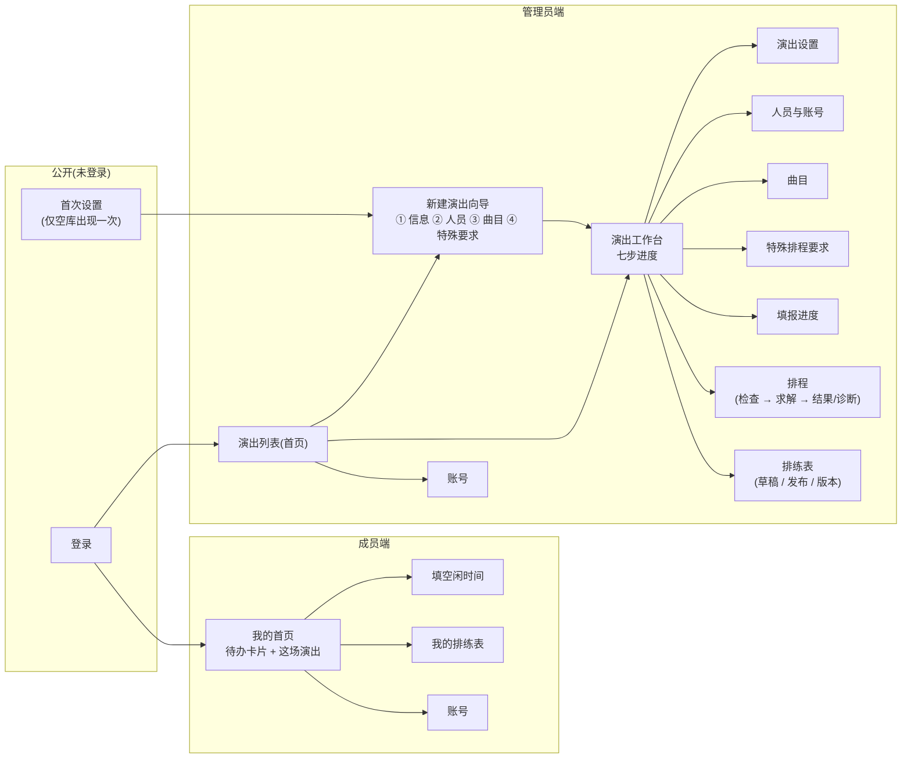
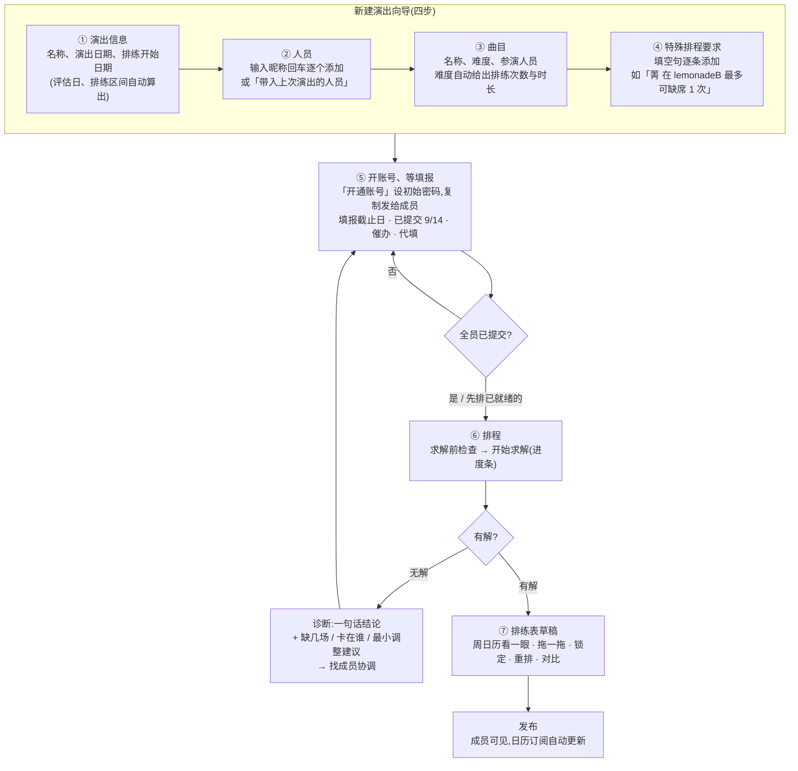
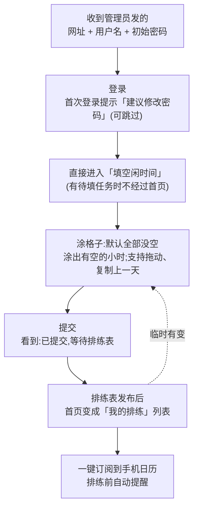
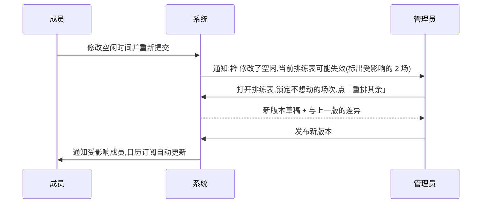

# 页面交互设计(v0.3.5)

> 目的:在做视觉之前,先把「每个页面是干什么的、用户在上面做什么、做完去哪」定下来。本稿只讨论**交互与流程**,不讨论颜色和样式。
> 状态:**8 项关键决定已由你确认(见 §9)**,本稿已按决定改写;请整体再过一遍,有不顺的地方继续改。
> 术语:界面里统一叫**「演出」**(一场演出 = 一次排程),不用「活动」。
> 视觉:以 `design/手机UI草图/` 为准(见开发文档 §7.3)。管理员端底部导航「工作台 / 排练表 / 账号」、成员端「排练表 / 账号」按草图;草图中的「邀请链接」按 v0.3 改为「开通账号」。

## 0. 这版和 M1 初稿的根本区别

M1 初稿照搬了数据模型的结构:「活动列表」「名册」「曲目」各一页。你看不出「名册」是干什么的,是因为它把**实现概念**(跨演出复用的总名单)直接摆给了用户。

| 初稿 | 这版 |
|---|---|
| 「活动列表」只有名字和日期,点进去不知道该干嘛 | 首页仍是**演出列表**(你的选择),但每张卡片直接写「距演出 12 天 · 进行到第 ③ 步:录曲目」;点进去是**七步进度工作台** |
| 独立的「名册」页 | 没有名册页。在演出里**直接添加人员**;下一场演出新建时,弹出「上次的人员」勾选即可沿用 |
| 建活动只是填一个表单 | **「新建演出」是一个四步向导**:演出信息 → 人员 → 曲目(难度、排练次数)→ 特殊排程要求 |
| 成员靠邀请链接自己注册 | **管理员直接开通账号**:在人员页给每人设用户名和初始密码,复制「网址 + 账号 + 密码」发给成员;成员首次登录后改密码。没有邀请页 |
| 特殊规则要到 M3 才有入口 | **特殊排程要求**是向导的第 4 步,用「填空句」添加,例如「菁 在 aespa-lemonadeB 最多可缺席 1 次」 |
| 成员登录后也看活动列表 | 成员登录后看到**待办卡片**(该填空闲了 / 已提交 / 排练表出来了),下面是这场演出的曲目和人员 |

---

## 1. 两种用户,各自只需要记住一句话

| 角色 | 一句话 | 使用设备 |
|---|---|---|
| **管理员**(队长 / 编导) | 「新建演出(信息、人员、曲目、特殊要求)→ 给大家开账号、等大家填 → 一键排 → 调一调 → 发布」 | 主要电脑,偶尔手机 |
| **成员** | 「用管理员给的账号登录 → 涂一下我什么时候有空 → 等排练表 → 加到日历」 | 几乎只用手机 |

---

## 2. 页面地图

向导的四步和 A2 / A3 / A4 / A10 四个页面是**同一套界面**:向导里按顺序走一遍,之后随时从工作台进去改。

---

## 3. 三条核心流程

### 3.1 管理员:从新建演出到发布

### 3.2 成员:从拿到账号到加进日历

### 3.3 有人临时改时间(发布后)

---

## 4. 新建演出向导(四步)

向导每一步都可以「稍后再填」,随时能退出,已填的会保存;走完第 ④ 步或点「完成」进入该演出的工作台。

### ① 演出信息

| | |
|---|---|
| 填什么 | 只填 3 项:**演出名称、演出日期、排练开始日期** |
| 实时反馈 | 下方立刻显示:「正规排练 9/4 周五 ~ 9/18 周五(15 天)· 全员评估 9/19 周六 · 每天 10:00–23:00」 |
| 高级 | 折叠的「更多设置」:每天最早 / 最晚、单日上限、评估场时长、难度对应的排练次数模板、**填报截止日**(默认演出前 10 天);默认值够用,可以不动 |
| 校验 | 开始日期晚于演出前两天 → 字段旁直接提示 |

### ② 人员

| | |
|---|---|
| 添加 | 一个输入框「输入昵称,回车添加」,可连续输入;支持一次粘贴多个名字(逗号 / 换行分隔) |
| 带入 | 若已有上一场演出,顶部一个按钮「带入上次演出的人员」→ 勾选列表(默认全选);带入的人如果已有账号,账号直接沿用,不用再开 |
| 列表 | 已添加的人员以标签形式排成一片,点 × 移除;这一步**不开账号**,开账号在工作台第 ⑤ 步做(先把曲目和要求录完再通知大家更合理) |
| 备注 | 每个名字可点开填备注(如「住得远」「周三有课」);备注只给管理员看 |

### ③ 曲目

| | |
|---|---|
| 添加 | 「+ 添加曲目」弹出一行表单:**曲目名称、难度(简单 / 一般 / 困难)、参演人员(多选)** |
| 难度 → 排练次数 | 选难度后自动填入排练方案并显示:简单「2 场 × 2h」、一般「1 场 3h + 2 场 2h」、困难「3 场 × 3h」;旁边可直接改成别的,如「1 场 2h」「1 场 3h + 1 场 2h」 |
| 代号 | 自动按 a、b、c… 给出,可改;代号用于排练表里的简称 |
| 列表 | 表格:代号 · 曲目 · 难度 · 参演人员 · 排练方案 · 场次;表尾汇总「12 首 · 25 场正规排练 + 1 场全员评估」 |
| 批量录入 | 「粘贴录入」:一行一首,格式「曲名 / 难度 / 人员1 人员2 …」,先预览识别结果(未识别的人名标红),确认后一次创建 |
| 提示 | 两首曲目参演人员完全相同 → 黄色提示,不阻止;人员不在第 ② 步名单里 → 提示先去添加 |

### ④ 特殊排程要求

| | |
|---|---|
| 目的 | 把这场演出的特殊情况告诉排程器,不用改代码 |
| 添加 | 「+ 添加要求」→ 选一种要求类型 → 出现一句**带空格的填空句**,空格用下拉选择 → 保存后以一句人话显示在列表里 |
| 列表 | 每条要求一行:人话句子 · 「硬性 / 尽量」标签 · 启用开关 · 删除;例:「**菁** 在 **aespa-lemonadeB** 最多可缺席 **1** 次」 |
| 冲突检查 | 保存时检查是否让某曲目完全排不下(如某天禁排后候选为 0),有问题就地提示 |

**可添加的要求类型**(首版):

| 填空句 | 硬性 / 尽量 | 说明 | 求解包对应 |
|---|---|---|---|
| **[成员]** 在 **[曲目]** 最多可缺席 **[N]** 次 | 尽量(只在必要时用) | 你举的例子。排程器优先让 TA 全到,排不开时才让 TA 缺席,最多 N 次;该曲目其他场次 TA 仍要到 | 新增规则类型 `member_song_max_absent`(严格层也允许该成员的缺席候选,计入「缺席最少」目标) |
| **[成员]** 在 **[曲目]** 最多参加 **[N]** 场 | 硬性 | TA 本来就只打算来 N 场(如原型里「菁在 lemonadeB 只来 1 场」) | `member_song_max_attendance`(已实现) |
| **[日期]** 整天不排练 | 硬性 | 场地没空、集体活动等 | `blocked_slots`(已实现) |
| **[日期]** 的 **[时段]** 不排练 | 硬性 | 同上,细到小时 | `blocked_slots`(已实现) |
| **[日期]** 最多排 **[N]** 场 | 硬性 | 控制某天强度 | `max_sessions_per_date`(已实现) |
| **[曲目]** 有一场固定在 **[日期] [时间]** | 硬性 | 已经和场地 / 老师约好的场次 | `fixed_sessions`(已实现) |
| 尽量把 **[成员]** 的排练集中在少数几天 | 尽量 | 住得远的成员少跑几趟 | `focus_members`(已实现) |

> 「某人某天不方便」不是这里的要求,而是成员自己在空闲网格里填「不可排 / 尽量避开」。

---

## 5. 管理员端页面

### L 演出列表(管理员首页)

| | |
|---|---|
| 目的 | 看到所有演出,一眼知道每场进行到哪 |
| 看到什么 | 每场演出一张卡片:名称、演出日期、**距演出 N 天**、**当前步骤**(「第 ③ 步:录曲目,已录 5 首」/「第 ⑤ 步:等填报,9/14 已提交」/「已发布 v2」);已结束的演出折叠到底部「往期」 |
| 操作 | 点卡片进入工作台;右上角「+ 新建演出」进入向导 |
| 空态 | 没有任何演出:整页只有「新建演出」按钮和一句说明 |

### A1 演出工作台(七步进度)

| | |
|---|---|
| 目的 | 让管理员一眼知道「这场演出进行到哪一步、下一步做什么」 |
| 怎么进 | 从演出列表点进来;向导完成后也到这里 |
| 看到什么 | 顶部:演出名、距演出 N 天、「← 演出列表」。中间:**七步进度条**:① 演出信息 ② 人员 ③ 曲目 ④ 特殊要求 ⑤ 填报 ⑥ 排程 ⑦ 排练表,每步显示未开始 / 进行中 / 已完成。下方:七张步骤卡片,每张一句状态 + 一个主按钮 |
| 卡片示例 | ① 「9/4–9/18 排练,9/19 评估」→ 修改 ② 「14 人,已开通账号 9 人」→ 管理人员 ③ 「12 首 · 25 场」→ 管理曲目 ④ 「3 条要求」→ 管理 ⑤ 「已提交 9/14,截止 9/3」→ 查看进度 ⑥ 「未开始」→ 去排程(前置条件不满足时灰掉并说明) ⑦ 「草稿 v2 / 已发布 v1」→ 查看 |

### A2 演出设置 / A4 曲目 / A10 特殊排程要求

就是向导 ①、③、④ 的同一套界面,从工作台进入后单独编辑。修改日期且已有排练表时提示「已发布的排练表不会自动改变,需要重排」。

### A3 人员与账号

| | |
|---|---|
| 列表 | 昵称 · 账号状态(未开通 / 已开通 / 已停用)· 填报状态(未填 / 已提交 / 已过截止未填)· 操作 |
| 开通账号 | 行内「开通账号」→ 弹窗:用户名(默认昵称,可改)、**初始密码(管理员自己输入)** → 保存后显示一段可复制的文字:「网址 https://… 用户名 衿 密码 ×××,登录后请修改密码」,一键复制发给成员 |
| 批量开通 | 「开通全部未开通的人员」:输入一个统一初始密码,一次开通;生成一份「每人一行」的账号清单可复制(建议之后提醒成员各自改密码) |
| 账号问题 | 已开通的行内:重置密码(管理员再输一个新密码)、停用 / 启用 |
| 移除 | 从本演出移除(不删人、不删账号);若已在曲目里,提示先从曲目移除 |
| 备注 / 别名 | 折叠在行内「更多」里,不占主视线 |

> 没有邀请链接、没有成员自助注册页。

### A5 填报进度

| | |
|---|---|
| 目的 | 知道谁没填、催、必要时代填;判断能不能开始排 |
| 看到什么 | 顶部大进度「已提交 9 / 14 · 截止 9/3(还有 2 天)」;列表分两组:未提交(置顶,可一键催办)、已提交(显示提交时间);下方「全员空闲热力图」:每天每小时有多少人有空 |
| 截止 | 截止前一天系统自动催一次;**到期不锁定**,成员仍可改,但页面标「已过截止」,管理员列表里也标出 |
| 代填 | 未提交成员行内「代填」→ 打开和成员端一样的网格,保存后标注「管理员代填」 |
| 做完去哪 | 全部提交后按钮「去排程」变亮 |

### A6 排程

| | |
|---|---|
| 目的 | 把「求解」变成一个按钮,把「无解」变成能执行的建议 |
| 进入时 | 先自动跑**求解前检查**,显示清单:全员已提交 ✔ / 每首曲目都有人员 ✔ / 评估日有全员共同空闲 ✘(差 2 人)… 有 ✘ 时按钮仍可点,但会提示 |
| 求解中 | 进度条 + 当前阶段名(「层级 L0:缺席最少…」),可取消;页面刷新不丢 |
| 有解 | 直接跳到排练表草稿(A7),顶部提示「已生成草稿 v3,严格最优 / 非严格最优,层级 L1(允许 2 场缺席)」 |
| 无解 | 诊断页:**先一句话**「差 3 场:曲目 c、f 排不下,主要卡在 若、思 的周末」;下面三段可展开:每曲缺口表 / 只差一人的时段 / 最小调整建议(受影响 2 人、共 5 小时,列出具体哪天哪几格);评估场单独一段 |
| 做完去哪 | 无解 → 「去催填报」回 A5,或直接联系成员后再来 |
| 检查有警告时 | 点「开始求解」先弹窗三选一:**返回补充** / **先排已就绪曲目**(跳过参演人员未全部提交的曲目)/ **仍然求解**(未提交者视为全程没空) |
| 已实现(M3) | 以上全部;最小调整建议按成员合并显示「10/12 周一 19:00–23:00」;上次结果留在页面上,可「重新求解」 |

### A7 排练表

| | |
|---|---|
| 目的 | 看、微调、发布 |
| 视图 | 默认**周视图日历**(每天一列、小时一行,场次色块按曲目着色,评估场用醒目区别);切换「列表」「按成员」 |
| 点一场 | 弹出:曲目、时间、参演人员、缺席标注;按钮:锁定 / 解锁 |
| 拖拽 | 拖动或拉伸;松手时校验:违反硬规则 → **弹回**并说「成员 幸 在 12:00–13:00 不可用」;只是软目标变差 → 允许并提示「成员往返 +1」 |
| 重排 | 「锁定后重排」:锁定的不动,其余重算;完成后自动显示与上一版差异 |
| 版本 | 顶部版本切换(v1 已发布 · v2 草稿 · v3 草稿);「对比」显示新增 / 删除 / 移动的场次和受影响成员 |
| 发布 | 发布前自动校验,0 错误才能发;发布后成员可见并收到通知 |
| 成员统计 | 折叠面板:每人总时长、天数、往返、空档,用来判断公平 |
| 已实现(M3 / M4) | 版本切换;**周日历**(课程表式:列 = 日期、行 = 小时,场次按曲目着色,同一时段两场并排;上周 / 下周切换;点日期 → 当天日程页;点场次 → 详情弹窗);「按日期」列表(评估场醒目块、缺席标红、第 n / N 场);「按成员」统计表;按成员筛选;校验结果;**发布 / 撤回**(校验 0 错误才能发,弹窗确认,旧版自动归档)。|
| 已实现(M5) | **拖动**色块移动场次(手机可用),松手时校验:违反硬规则 → 弹回并提示原因;只是软目标变差 → 允许并提示「成员额外往返 +1」;点场次 → 弹窗「锁定 / 解锁」;「锁定后重排」→ 求解页保留锁定场次重排其余,完成后自动打开与上一版的对比;「对比版本」面板列出移动 / 变更 / 新增 / 删除与受影响成员;发布后有成员改空闲 → 顶部提示「X 修改了空闲,N 场受影响」并列出具体场次与时段。发布的版本不可变:在它上面拖动或锁定会自动复制成新草稿。时长不可拉伸(由曲目排练方案决定) |

---

## 6. 成员端

### M1 成员首页(待办 + 这场演出)

| | |
|---|---|
| 目的 | 成员打开就知道现在该干嘛,顺便能看到自己在这场演出里的角色 |
| 上半部 | 一张大**待办卡片**,按状态变化:**待填**「请在 9/3 前填写空闲时间」→ 按钮「去填写」;**已提交**「已提交,等待排练表(还有 3 人没填)」→ 可再修改;**已过截止未填**「已过截止,请尽快填写」;**已发布**「你的排练表出来了:8 场」→ 列表 + 「订阅到日历」按钮 |
| 下半部 | **这场演出**:演出日期、距演出 N 天;「我的曲目」(自己参演的曲目,每首显示难度、场次、一起跳的人);「全部曲目」折叠;「人员」列表(只显示昵称) |
| 多场演出 | 同时参加两场演出时,顶部切换 |
| 首次登录 | 弹一次「建议修改初始密码」,可跳过;账号页随时可改 |
| 底部 | 两个入口:「排练表」「账号」 |

### M2 填空闲时间(手机为主)

| | |
|---|---|
| 目的 | 两分钟内涂完一周 |
| 默认值 | **打开时全部是「没空」**;成员涂出有空的小时 |
| 布局 | 上方**日期横向可滑动**(9/4 五 · 9/5 六 · …),下方是当天 13 个小时的竖列;每格三态:有空 / 尽量避开 / 没空 |
| 操作 | 顶部选画笔(「有空」为默认画笔,另有「尽量避开」「没空」),点一格或按住滑过多格;「复制上一天」「全天有空」「全天没空」三个快捷键;右上角显示「已填 5 / 16 天」 |
| 评估日 | 和其他天一样的网格,只是这一天用不同颜色标「全员评估日(演出前一天)」,提示「这天只排一场 2–3 小时的全员评估」 |
| 截止 | 顶部显示「截止 9/3」;过期后仍可填,显示「已过截止」 |
| 提交 | 底部固定「提交」;提交后仍可修改,修改会提示「排练表可能受影响」 |

### M3 我的排练表

| | |
|---|---|
| 看到什么 | 按日期分组的列表:9/6 周日 13:00–15:00 · k blackpink-玩火 · 和 菁、Siri、嘎;评估场置顶标出「全员评估」及自己的到场时段 |
| 订阅 | 「添加到手机日历」→ 显示 iPhone / Android 各一行说明 + 复制链接;成功后排练前自动提醒 |
| 变更 | 排练表更新时首页和这里都标「有 2 场变动」,变动的场次高亮 |
| 已实现(M4) | 顶部「**我的时间表 / 全体成员**」切换 + 「周日历 / 列表」切换;周日历与管理员端同一套(点日期 → 当天日程页,同样可切换我的 / 全体);首页待办卡片发布后变成「下一场:…」;「订阅到手机日历」面板(添加到日历 / 复制链接 / 重置链接);「有 N 场变动」高亮在 M5 随版本对比一起做 |

### 公开页:首次设置 / 登录

- 首次设置:只在空库出现一次;创建管理员后直接进入「新建演出」向导。
- 登录:用户名 + 密码;5 次错密码后提示 15 分钟后再试;没有「找回密码」,页面直接写「忘记密码请找管理员重置」。

---

## 7. 贯穿所有页面的规则

1. **每页只有一个主按钮**,其余是次要操作。
2. **前置条件不满足时按钮不消失,而是灰掉并说原因**(「先添加人员」)。
3. **出错就地显示**:字段旁边、行内,而不是弹一个通用错误框。
4. **危险操作二次确认并说明后果**(删除演出会一起删除曲目和填报)。
5. **成员端所有页面单手可操作**,主按钮固定在底部。
6. **状态可回退**:提交后可改、发布后可重排,没有不可逆的死路(除删除)。

---

## 8. 对已实现代码(M1)的影响

| 变化 | 处理 |
|---|---|
| 不再用邀请链接 | 去掉 `Invite` 相关接口与页面;新增「管理员开通账号」接口:`POST /api/members/{id}/account`(用户名 + 初始密码),批量版 `POST /api/events/{id}/accounts`;`User` 增加 `must_change_password` 标记,首次登录提示 |
| 首页改为演出列表 + 工作台 | 演出接口增加「当前步骤 / 各步状态」汇总字段;前端重做:演出列表、向导、工作台、人员与账号、曲目、特殊要求 |
| 没有名册页 | 名册接口保留在后台(供「带入上次人员」和自动关联同名成员),前端不再有独立页面 |
| 特殊排程要求前置到向导 | M3 的 `Rule` 模型提前到下一阶段实现;求解包新增 `member_song_max_absent` 规则类型 |
| 填报截止日 | `Event` 增加 `availability_deadline`;到期只提醒不锁定 |
| 成员可看曲目和人员 | 现有接口已允许成员读取本演出的曲目与人员,前端增加展示 |

---

## 9. 已确认的决定(2026-09-21)

| # | 问题 | 决定 |
|---|---|---|
| 1 | 管理员首页 | **演出列表**;点进演出后是七步进度工作台 |
| 2 | 成员管理 | 没有名册页;在演出里直接添加人员,新建演出时可带入上次人员 |
| 3 | 新建演出 | **四步向导**:信息 → 人员 → 曲目(难度、排练次数)→ 特殊排程要求 |
| 4 | 成员开通账号 | **不用邀请链接**;管理员在人员页给每人设用户名和**自己输入的初始密码**,复制发给成员 |
| 5 | 空闲网格默认值 | **默认全部「没空」**,成员涂出有空的时间 |
| 6 | 成员首页 | **待办卡片 + 可查看这场演出的曲目和人员** |
| 7 | 填报截止 | **要**;到期只提醒,不锁定 |
| 8 | 评估日填报 | 和其他天**一样的网格**,只做标注 |
| 9 | 桌面显示 | 手机按草图;**电脑上展开为宽屏布局**(左侧导航 + 三列步骤卡片 + 周视图) |

## 10. 修订记录

| 版本 | 内容 |
|---|---|
| v0.1 | 首稿:工作台 + 六步进度、取消名册页、成员端待办式 |
| v0.2 | 按你的描述改为「新建演出」四步向导;新增「特殊排程要求」页与要求类型表;术语「活动」→「演出」;工作台七步 |
| v0.3.5 | A7 补充 M5 已实现范围:拖动移动、锁定与锁定后重排、版本对比、空闲变更冲突提示;M2 填空闲页在已发布时提示影响 |
| v0.3.4 | A7 / M3 补充 M4 已实现范围:周日历、当天日程页、我的 / 全体切换、发布与撤回、日历订阅;3.1 流程图改为向导横排 |
| v0.3.3 | A6 / A7 补充 M3 已实现范围与「检查有警告时」的三选一弹窗 |
| v0.3.2 | 决定 #9:桌面展开为宽屏布局 |
| v0.3.1 | 挂接手机 UI 草图作为视觉基准;补充两端底部导航 |
| v0.3 | 写入 8 项决定:首页改为演出列表;取消邀请链接,改为管理员开通账号并自设初始密码;空闲默认「没空」;成员首页加曲目与人员;填报截止(只提醒);评估日同网格标注;新增 §8「对已实现代码的影响」 |
