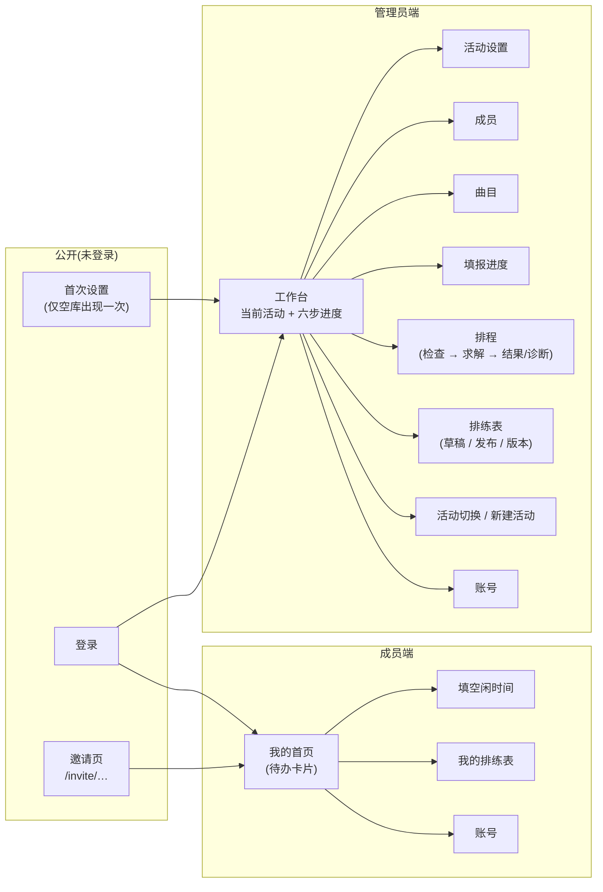
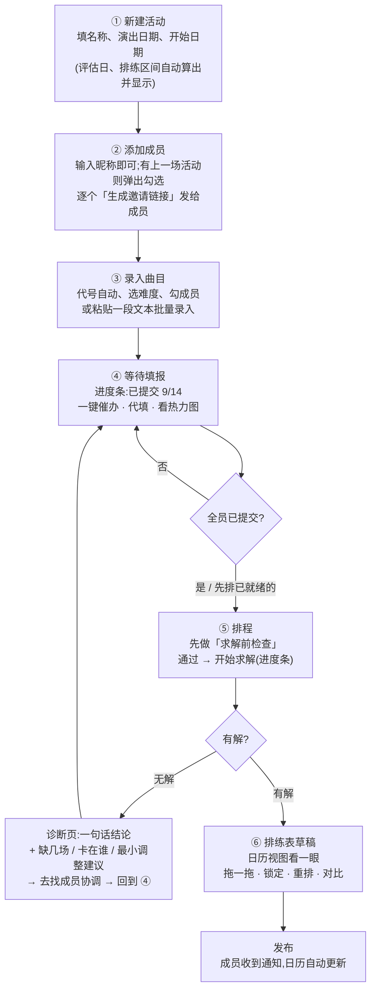
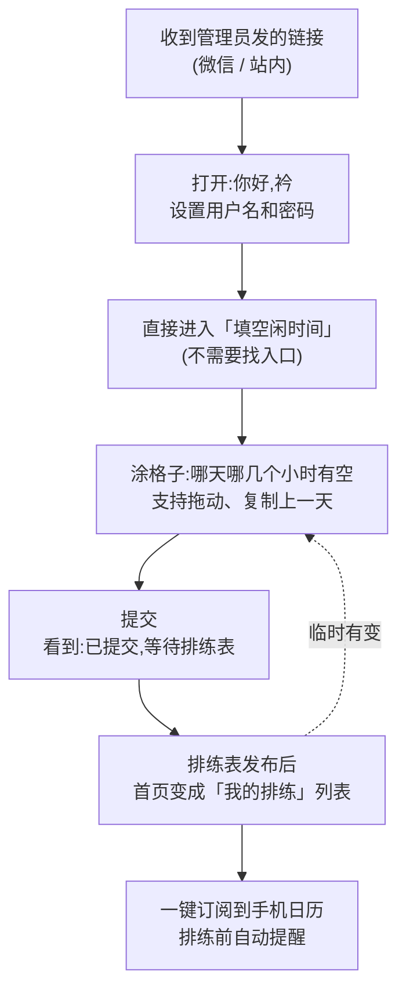
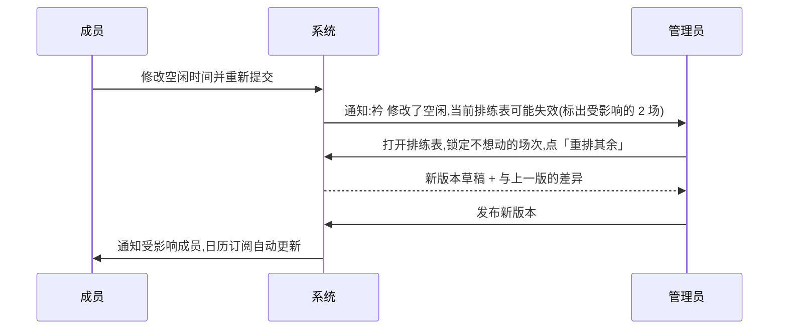

# 页面交互设计(草稿 v0.1)

> 目的:在做视觉之前,先把「每个页面是干什么的、用户在上面做什么、做完去哪」定下来。本稿只讨论**交互与流程**,不讨论颜色和样式。
> 状态:**草稿,待你逐项确认**。确认后据此重做前端页面;开发文档 §4 的功能需求不变,本稿决定它们如何被组织成页面。

## 0. 这版和 M1 初稿的根本区别

M1 初稿照搬了数据模型的结构:「活动列表」「名册」「曲目」各一页。你看不出「名册」是干什么的,是因为它把**实现概念**(跨活动复用的总名单)直接摆给了用户。

这版改成**以「这场演出」为中心、按步骤推进**:

| 初稿 | 这版 |
|---|---|
| 登录后先看「活动列表」 | 登录后直接进入**当前活动的工作台**,活动列表退到右上角的切换菜单 |
| 独立的「名册」页 | 没有名册页。在活动里**直接添加成员**;下一场演出新建活动时,弹出「上次的成员」勾选即可沿用 |
| 每个页面各管各的 | 工作台顶部有**六步进度条**,每一步告诉你「现在该做什么」和「还差什么」 |
| 成员登录后也看活动列表 | 成员登录后只看到**一件事**:该填空闲了 / 已提交等结果 / 排练表出来了 |

---

## 1. 两种用户,各自只需要记住一句话

| 角色 | 一句话 | 使用设备 |
|---|---|---|
| **管理员**(队长 / 编导) | 「建活动 → 加人 → 录曲目 → 等大家填 → 一键排 → 调一调 → 发布」 | 主要电脑,偶尔手机 |
| **成员** | 「点链接 → 涂一下我什么时候有空 → 等排练表 → 加到日历」 | 几乎只用手机 |

---

## 2. 页面地图

---

## 3. 三条核心流程

### 3.1 管理员:从零到发布

### 3.2 成员:从收到链接到加进日历

### 3.3 有人临时改时间(发布后)

---

## 4. 逐页交互说明

每页用同一套格式:**目的 / 谁用 / 怎么进 / 看到什么 / 能做什么 / 空态与出错 / 做完去哪**。

### A1 工作台(管理员首页)

| | |
|---|---|
| 目的 | 让管理员一眼知道「这场演出进行到哪一步、下一步做什么」 |
| 怎么进 | 登录后直接到这里;右上角可切换活动 |
| 看到什么 | 顶部:活动名、演出日期倒计时(「距演出 12 天」)。中间:**六步进度条**,每步显示状态(未开始 / 进行中 / 已完成)。下方:六张步骤卡片,每张一句状态 + 一个主按钮 |
| 六张卡片 | ① 活动设置「9/4–9/18 排练,9/19 评估」→ 修改 ② 成员「14 人,已邀请 9 人」→ 管理成员 ③ 曲目「12 首 · 25 场」→ 管理曲目 ④ 填报「已提交 9/14」→ 查看进度 ⑤ 排程「未开始」→ 去排程(有前置条件时按钮灰掉并说明原因) ⑥ 排练表「草稿 v2 / 已发布 v1」→ 查看 |
| 空态 | 没有任何活动:整页只有一个「新建活动」按钮和一句说明 |
| 做完去哪 | 点任一卡片进入对应页面;页面完成后回到工作台,进度条更新 |

### A9 新建活动 / 切换活动

| | |
|---|---|
| 目的 | 每场演出一个活动;换活动像换标签页一样轻 |
| 怎么进 | 工作台右上角活动名 → 下拉:其他活动、「+ 新建活动」 |
| 新建时填什么 | 只填 3 项:名称、演出日期、排练开始日期。页面**实时显示**推算出的「正规排练区间(N 天)」和「评估日」。其余参数用默认值,进活动设置再改 |
| 沿用成员 | 若已有活动,新建后立刻弹出「从上次活动带入成员?」全选 / 勾选 |
| 做完去哪 | 工作台,进度条停在第 ② 步 |

### A2 活动设置

| | |
|---|---|
| 目的 | 改日期、每日窗口、规则参数 |
| 看到什么 | 两段:**基本**(名称、日期、每天最早 / 最晚)和**规则**(折叠,默认收起:上限、评估场时长、难度模板、同曲不同天…) |
| 能做什么 | 改任一项,保存;日期变化时实时重算区间与评估日;不合法时在字段旁直接说明(如「开始日期必须不晚于演出前两天」) |
| 注意 | 已有排练表时修改日期 → 提示「已发布的排练表不会自动改变,需要重排」 |

### A3 成员(本活动)

| | |
|---|---|
| 目的 | 谁参加这场演出;给他们发邀请;看谁还没开通账号 |
| 看到什么 | 列表:昵称 · 账号状态(未邀请 / 已发邀请 / 已开通)· 填报状态(未填 / 已提交)· 操作 |
| 添加成员 | 顶部一个输入框「输入昵称回车」,连续添加;若名字和上一场活动的成员一样,自动关联(不重复建人) |
| 沿用旧成员 | 「从以前的成员中添加」→ 弹出勾选列表 |
| 邀请 | 每行「生成邀请链接」→ 弹出**链接 + 二维码**,可复制;再点一次是「重新生成」(旧链接作废) |
| 账号问题 | 已开通的成员行内:重置密码(显示一次性临时密码)、停用 |
| 移除 | 从本活动移除(不删人);若已在曲目里,提示先从曲目移除 |
| 备注 / 别名 | 折叠在行内「更多」里,不占主视线 |

> 没有独立的「名册」页。总名单只在「从以前的成员中添加」时出现。

### A4 曲目

| | |
|---|---|
| 目的 | 录入这场演出的曲目、难度、参演成员;看总场次 |
| 看到什么 | 表格:代号 · 曲目 · 难度 · 参演成员 · 场次方案 · 场次数;表头下方一行汇总「12 首 · 25 场正规排练 + 1 场全员评估」 |
| 添加(逐个) | 弹窗:代号自动给下一个字母;难度三选一,旁边直接写出模板场次;成员多选;可选「覆盖场次方案」;底部实时显示「本曲 2 场:3h + 2h」 |
| 快速录入 | 「粘贴录入」:一行一首,格式「曲名 / 难度 / 成员1 成员2 …」,先预览识别结果(未识别的成员名标红),确认后一次创建 |
| 提示 | 两首曲目成员完全相同 → 黄色提示,不阻止 |
| 前置条件 | 活动还没成员时,添加按钮禁用并提示先去 ② 添加成员 |

### A5 填报进度

| | |
|---|---|
| 目的 | 知道谁没填、催、必要时代填;判断能不能开始排 |
| 看到什么 | 顶部大进度「已提交 9 / 14」;列表分两组:未提交(置顶,可一键催办)、已提交(显示提交时间);右侧 / 下方「全员空闲热力图」:每天每小时有多少人有空 |
| 代填 | 未提交成员行内「代填」→ 打开和成员端一样的网格,保存后标注「管理员代填」 |
| 截止 | 可设填报截止时间;截止前系统自动催一次 |
| 做完去哪 | 全部提交后按钮「去排程」变亮 |

### A6 排程

| | |
|---|---|
| 目的 | 把「求解」变成一个按钮,把「无解」变成能执行的建议 |
| 进入时 | 先自动跑**求解前检查**,显示清单:全员已提交 ✔ / 每首曲目都有成员 ✔ / 评估日有全员共同空闲 ✘(差 2 人)… 有 ✘ 时按钮仍可点,但会提示 |
| 求解中 | 进度条 + 当前阶段名(「层级 L0:缺席最少…」),可取消;页面刷新不丢 |
| 有解 | 直接跳到排练表草稿(A7),顶部提示「已生成草稿 v3,严格最优 / 非严格最优,层级 L1(允许 2 场缺席)」 |
| 无解 | 诊断页:**先一句话**「差 3 场:曲目 c、f 排不下,主要卡在 若、思 的周末」;下面三段可展开:每曲缺口表 / 只差一人的时段 / 最小调整建议(受影响 2 人、共 5 小时,列出具体哪天哪几格);评估场单独一段 |
| 做完去哪 | 无解 → 「去催填报」回 A5,或直接联系成员后再来 |

### A7 排练表

| | |
|---|---|
| 目的 | 看、微调、发布 |
| 视图 | 默认**周视图日历**(每天一列、小时一行,场次色块按曲目着色,评估场用醒目区别);切换「列表」「按成员」 |
| 点一场 | 弹出:曲目、时间、参演成员、缺席标注;按钮:锁定 / 解锁 |
| 拖拽 | 拖动或拉伸;松手时校验:违反硬规则 → **弹回**并说「成员 幸 在 12:00–13:00 不可用」;只是软目标变差 → 允许并提示「成员往返 +1」 |
| 重排 | 「锁定后重排」:锁定的不动,其余重算;完成后自动显示与上一版差异 |
| 版本 | 顶部版本切换(v1 已发布 · v2 草稿 · v3 草稿);「对比」显示新增 / 删除 / 移动的场次和受影响成员 |
| 发布 | 发布前自动校验,0 错误才能发;发布后成员可见并收到通知 |
| 成员统计 | 折叠面板:每人总时长、天数、往返、空档,用来判断公平 |

### M1 成员首页(待办式)

| | |
|---|---|
| 目的 | 成员打开就知道现在该干嘛 |
| 看到什么 | 一张大卡片,按状态变化:**待填**「请在 9/3 前填写空闲时间」→ 按钮「去填写」;**已提交**「已提交,等待排练表(还有 3 人没填)」→ 可再修改;**已发布**「你的排练表出来了:8 场」→ 列表 + 「订阅到日历」按钮 |
| 多个活动 | 同时参加两场演出时显示两张卡片 |
| 底部 | 只有两个入口:「排练表」「账号」 |

### M2 填空闲时间(手机为主)

| | |
|---|---|
| 目的 | 两分钟内涂完一周 |
| 布局 | 上方**日期横向可滑动**(9/4 五 · 9/5 六 · …),下方是当天 13 个小时的竖列;每格三态:可排 / 尽量避开 / 不可排 |
| 操作 | 顶部选画笔(三态之一),点一格或按住滑过多格;「复制上一天」「全天可排」「全天不可排」三个快捷键;右上角显示「已填 5 / 16 天」 |
| 默认值 | **待定**(见问题 3) |
| 提交 | 底部固定「提交」;提交后仍可修改,修改会提示「排练表可能受影响」 |
| 评估日 | 单独标出「这天是全员评估日,只需 2–3 小时」 |

### M3 我的排练表

| | |
|---|---|
| 看到什么 | 按日期分组的列表:9/6 周日 13:00–15:00 · k blackpink-玩火 · 和 菁、Siri、嘎;评估场置顶标出「全员评估」及自己的到场时段 |
| 订阅 | 「添加到手机日历」→ 显示 iPhone / Android 各一行说明 + 复制链接;成功后排练前自动提醒 |
| 变更 | 排练表更新时首页和这里都标「有 2 场变动」,变动的场次高亮 |

### 公开页:首次设置 / 登录 / 邀请

- 首次设置:只在空库出现一次;创建后直接进入工作台的「新建活动」。
- 登录:用户名 + 密码;5 次错密码后提示 15 分钟后再试;没有「找回密码」,页面直接写「忘记密码请找管理员重置」。
- 邀请页:显示「你好,衿」;设置账号后**直接进入填空闲**,不经过首页。

---

## 5. 贯穿所有页面的规则

1. **每页只有一个主按钮**,其余是次要操作。
2. **前置条件不满足时按钮不消失,而是灰掉并说原因**(「先添加成员」)。
3. **出错就地显示**:字段旁边、行内,而不是弹一个通用错误框。
4. **危险操作二次确认并说明后果**(删除活动会一起删除曲目和填报)。
5. **成员端所有页面单手可操作**,主按钮固定在底部。
6. **状态可回退**:提交后可改、发布后可重排,没有不可逆的死路(除删除)。

---

## 6. 需要你决定的问题

1. **管理员首页**:按上面改成「当前活动工作台 + 六步进度」,还是保留「活动列表」?
2. **成员管理**:取消独立「名册」页,改为在活动里直接加人 + 新建活动时「带入上次成员」,可以吗?
3. **空闲网格默认值**:成员打开时全部是「不可排」、需要涂出有空的时间(推荐,填得更认真);还是全部「可排」、涂出没空的时间(填得更快,但容易漏)?
4. **成员首页**:待办式(只显示当前该做的事),还是也让成员看到整个活动的曲目和成员?
5. **邀请方式**:链接 + 二维码,够吗?是否需要「一键复制全部成员的邀请链接」批量发?
6. **填报截止时间**:要不要?到期后是锁定不能再改,还是只是提醒?
7. **评估场**:成员填空闲时,评估日是否单独用一个更简单的问法(「9/19 下午 / 晚上你哪几个小时能到?」)?
