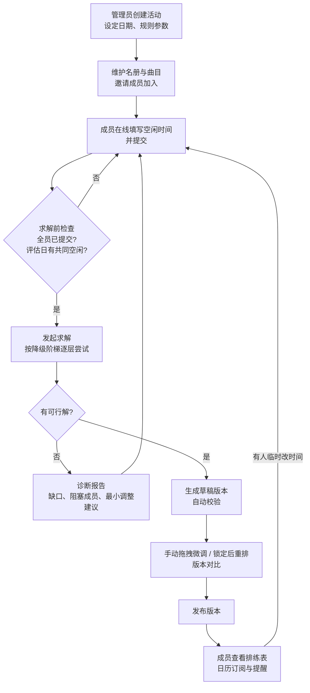
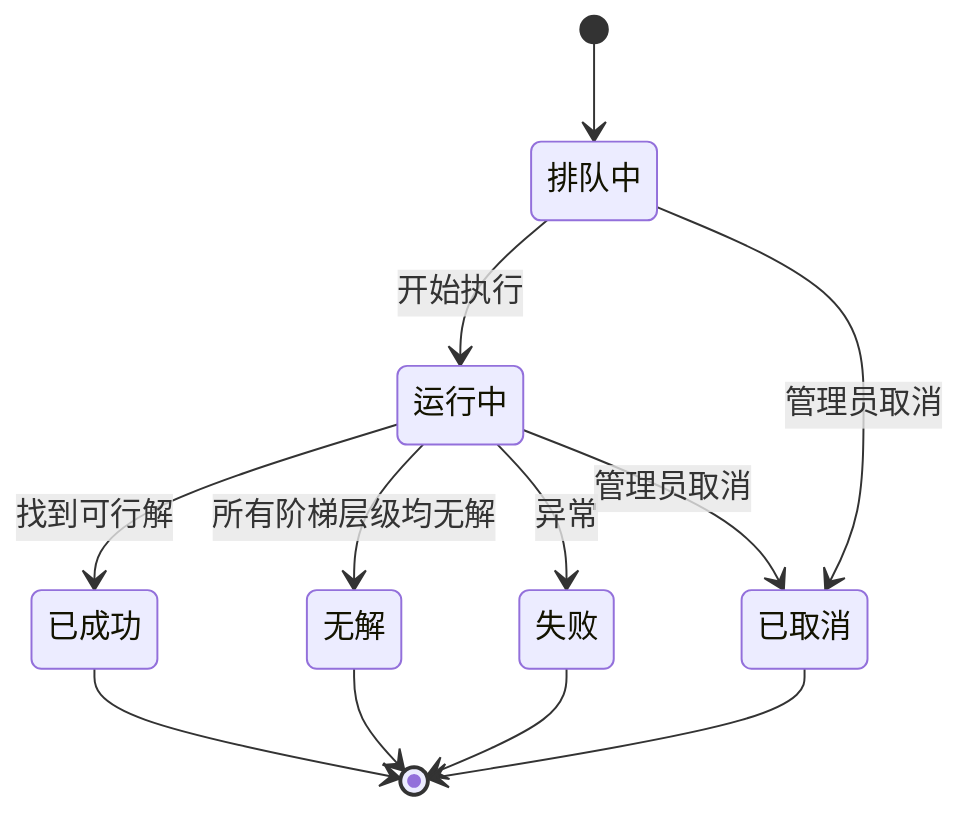
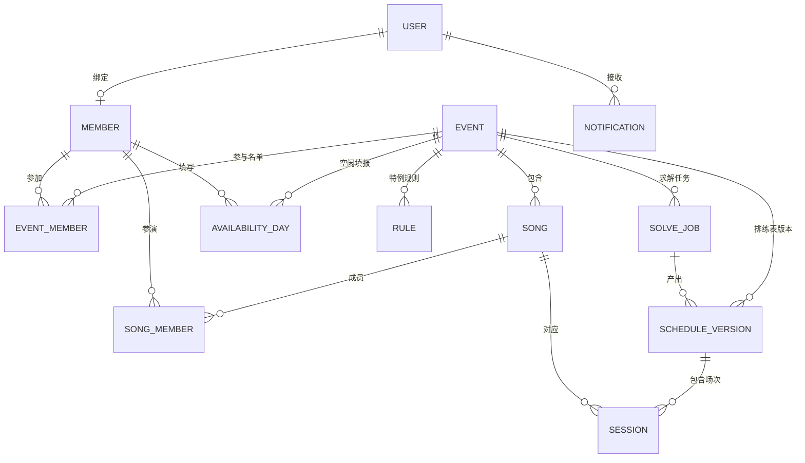
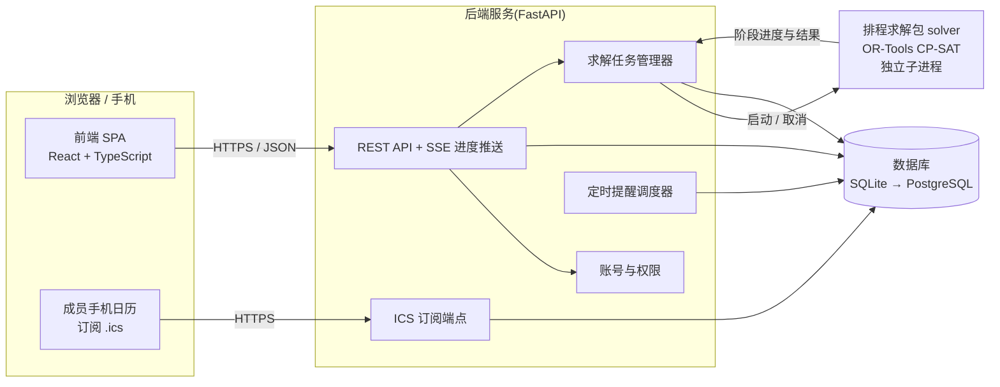

# 舞团排练排程系统 · 开发文档

> **版本** v0.2(需求确认稿) · **日期** 2026-09-21 · **状态** 需求基本确认,少量事项待确认(见 §13.2);尚未开始开发

| 项目 | 内容 |
|---|---|
| 文档目的 | 把「舞团路演排练排程」从一份 Colab 脚本,升级为前后端完整、可复用的 Web 程序,并作为开发依据 |
| 输入材料 | ① 《时间调度代码要求》(需求与数学模型) ② `untitled11.py`(Colab 原型) ③ 2026-09-21 需求访谈(共 3 轮) |
| 快速阅读 | 想了解结论:读 §1、§2;想了解算法:读 §5;想开工:读 §7、§11 |
| 优先级说明 | **P0** 首版必须 · **P1** 首版应有(上线前完成) · **P2** 后续迭代 |

---

## 目录

1. [项目概述](#1-项目概述)
2. [需求访谈结论](#2-需求访谈结论)
3. [术语与核心概念](#3-术语与核心概念)
4. [功能需求](#4-功能需求)
5. [排程算法规格](#5-排程算法规格)
6. [数据模型](#6-数据模型)
7. [系统架构与技术选型](#7-系统架构与技术选型)
8. [接口设计(概要)](#8-接口设计概要)
9. [非功能需求](#9-非功能需求)
10. [运行与部署](#10-运行与部署)
11. [开发计划与里程碑](#11-开发计划与里程碑)
12. [测试与验收](#12-测试与验收)
13. [风险与开放问题](#13-风险与开放问题)
14. [附录](#14-附录)

---

## 1. 项目概述

### 1.1 背景

舞团为路演(原定 2026-09-20)排练 12 首曲目,共 14 名成员,一名成员会参加多首曲目。每首曲目按难度需要 2–3 次、每次 2–3 小时的**连续**排练,同时必须避开成员时间冲突,并落在每日可排练的时间窗口内(原型按末班车设为 11:00–次日 01:00,现改为每天 10:00–23:00)。人工协调几乎不可能,因此已有原型用 OR-Tools CP-SAT 做「字典序分层优化」,并在无解时给出诊断和最小调整建议。

原型目前的局限:

- 只能在 Google Colab 里上传文件运行;输入靠每人一份 Excel。
- 曲目、成员、日期、个人特例写死在代码里(如 `SONG_SESSION_OVERRIDE`、`FOCUS_MEMBER = "菁"`),下一场演出无法复用。
- 代码与需求文档有多处不一致(见 §2.3)。
- 没有成员端、没有结果调整、没有版本管理、没有通知。

### 1.2 产品目标

| 编号 | 目标 | 衡量方式 |
|---|---|---|
| G1 | 成员在线自助填写空闲时间;管理员一键求解,得到满足全部硬约束的排练表 | 从「全员提交」到「得到可发布版本」的操作 ≤ 10 分钟(含求解) |
| G2 | 规则参数化,可复用于多场活动,换活动不改代码 | 新建一个活动只需填日期、名册、曲目、规则,无需改动程序 |
| G3 | 无解时给出可执行的诊断和最小调整建议 | 诊断报告能指出「缺几场、卡在谁的哪几个小时、最小调整方案」 |
| G4 | 排练表发布后可微调、锁定重排、版本对比,成员通过日历订阅获得变更 | 任何发布版本都通过独立校验器 0 错误 |

### 1.3 范围

**首版做(In Scope)**

- 账号体系(管理员 + 成员)、以「活动」为单位的多场活动管理
- 成员在线网格填写空闲时间(三态)
- 规则与参数配置、优化优先级拖拽排序、缺席降级阶梯
- 异步求解、进度显示、无解诊断、全员评估场
- 排练表日历/列表/个人视图,草稿与发布
- 手动拖拽微调 + 实时冲突校验;锁定后重排;版本对比
- 日历订阅(.ics)与提醒、站内通知

**首版不做(Out of Scope)**

| 事项 | 原因 / 处理 |
|---|---|
| Excel 导入 | 已确认成员在线自填;历史 Excel 迁移脚本列 P2 |
| Excel 导出 | 访谈中未选择;成本低,列 P2 |
| 练习室 / 场地建模 | 已确认「不建模场地」;数据模型预留 `room_id` 字段 |
| 第三方登录、邮箱找回密码 | 首版用「用户名 + 密码」,管理员可重置;列 P2 |
| 多舞团 SaaS(数据隔离) | 首版是「一个舞团、多场活动」 |
| 走台 / 轻量复习类型 | 原文档设想,已被「全员评估场」取代 |
| 日历导入(.ics) | 访谈中未选择 |
| 30 分钟时间格 | 参数预留,首版只验证 60 分钟 |
| 邮件 / 手机推送提醒 | 首版用日历自带提醒 + 站内通知;列 P2 |

### 1.4 角色与权限

| 角色 | 说明 |
|---|---|
| **管理员** | 队长 / 编导。管理名册、曲目、规则,发起求解,编辑与发布排练表,可代填成员空闲时间 |
| **成员** | 登录后填写自己的空闲时间,查看已发布的排练表,订阅日历 |

| 功能 | 管理员 | 成员 |
|---|:---:|:---:|
| 查看活动概览与填报进度 | ✔ | 仅自己的状态 |
| 管理名册、曲目、邀请与账号 | ✔ | ✘ |
| 填写 / 提交自己的空闲时间 | ✔ | ✔ |
| 查看或代填他人的空闲时间 | ✔ | ✘ |
| 查看全员空闲总览(热力图) | ✔ | ✘ |
| 配置规则、优先级、降级阶梯 | ✔ | ✘ |
| 发起求解、查看诊断 | ✔ | ✘ |
| 编辑草稿、锁定、重排、版本对比、发布 | ✔ | ✘ |
| 查看已发布排练表(含他人曲目) | ✔ | ✔ |
| 订阅个人日历、查看通知 | ✔ | ✔ |

---

## 2. 需求访谈结论

### 2.1 已确认决策

| 编号 | 议题 | 结论 | 对设计的影响 |
|---|---|---|---|
| D-01 | 使用者 | 管理员 + 成员**账号登录** | 需要账号、会话、权限体系和成员端 |
| D-02 | 使用范围 | **可复用于多场活动** | 「活动」是顶层业务对象;名册可沿用;日期与规则全部参数化 |
| D-03 | 空闲时间录入 | **成员自己在线网格填写** | 需要移动端友好的网格组件;不做 Excel 导入 |
| D-04 | 场地 | **不建模场地** | 只保证成员不冲突;不限制同时排练场次;预留 `room_id` |
| D-05 | 缺席策略 | **严格优先 + 可配置降级阶梯** | 先求全员到齐;无解时按阶梯逐级放宽并逐场标注缺席成员 |
| D-06 | 原 9/19 规则 | **取消原约束**,改为:公演前一天**不得安排任何正规排练**,并**恰好安排 1 场全员参加的评估**(2–3 小时,优先 3 小时,固定在公演前一天);3 小时场允许迟到早退,见 D-11 | 见 §5.5 的 HC-05 / HC-06 |
| D-07 | 结果功能 | 手动拖拽微调;锁定后重排 + 版本对比;日历订阅与提醒 | 见 §4.7–4.9 |
| D-08 | 部署 | 希望成本最低;**不懂部署**;先在本机运行,上线时在 **Oracle Always Free** 与 **Fly.io** 中选最便宜的可行方案 | 阶段化交付,见 §10 |
| D-09 | GitHub | 新建**公开**仓库 `rehearsal-scheduler` | 仓库不得包含成员真实空闲数据与个人信息,见 §10.5 |
| D-10 | 每日排练时间窗口 | **每天最早 10:00、最晚 23:00**,不再区分工作日与周末(取代原末班车规则:工作日至次日 01:00、周六日至次日 00:00) | 每日 13 个时间格;窗口不跨午夜;取消「00:00–01:00 归属前一日」的特殊处理 |
| D-11 | 评估场到场规则 | 3 小时的评估场**允许成员迟到或早退**;**普通排练不允许** | 见 §5.5 HC-06;评估场记录每位成员的实际到场时段 |
| D-12 | 曲目与成员来源 | 每场演出的曲目和成员都不同,由**管理员提前录入**;系统不预置数据 | 附录 A 仅作测试与演示夹具;提供录入便利功能(SONG-05) |

> 关于 D-06:访谈中写作「리얼서평가」,按「리허설 평가(彩排评估)」理解并已获确认。文档中统称**全员评估场**。

### 2.2 默认假设与确认状态

下表是访谈中你没有明确回答、或我按惯例补全的事项。**状态**列说明目前的确认情况;不同意「已采纳」项直接告诉我即可修改。

| 编号 | 假设 | 状态 |
|---|---|---|
| A-01 | 默认优化顺序:全部排完 > 缺席最少 > 困难曲目尽早 > 同曲间隔 ≥ 1 天 > 〔可选〕指定成员集中排练日 > 成员往返最少 > 成员空档最少 > 单日超时最少 > 软偏好避让;界面可拖拽调整。原文档的「9/19 保护」一项由硬规则 HC-05/06 取代 | 已采纳(未提异议) |
| A-02 | 账号:用户名 + 密码;管理员为名册成员生成**邀请链接**,成员打开后设置用户名和密码并自动绑定名册身份;管理员可重置密码、代填空闲时间 | 已采纳(未提异议) |
| A-03 | 「同曲不同天」为硬约束(沿用原型,可在活动参数中关闭);「同曲间隔 ≥ 1 天」为软目标 | 已采纳(未提异议) |
| A-04 | 全员评估场时长取 2 或 3 小时,由求解器选择,**优先 3 小时**;3 小时场允许迟到早退(A-16),2 小时场必须全员全程 | 已确认 |
| A-05 | 评估场不计入任何曲目的场次;每位成员都必须参加,**任何降级层级都不放宽**;受每日 10:00–23:00 窗口限制 | 已确认 |
| A-06 | 提醒渠道:日历自带提醒(ICS 中的 `VALARM`,默认提前 1 天和 2 小时)+ 站内通知 | 已采纳(未提异议) |
| A-07 | 活动默认时区 `Asia/Seoul`(由本机时区推断),可在活动中修改 | 已采纳(未提异议) |
| A-08 | 界面语言首版仅简体中文,前端预留多语言框架 | 已采纳(未提异议) |
| A-09 | 成员只能查看和编辑**自己的**空闲时间;可查看已发布排练表(含他人曲目);管理员可见全部 | 已采纳(未提异议) |
| A-10 | 曲目、成员、场次方案全部由管理员在每场演出前录入,系统不预置;附录 A 的示例数据(含曲目 a 的场次差异)只是测试夹具,不需要统一 | 已确认(D-12) |
| A-11 | 排练开始日期以活动参数为准(原文档 09-03,原型 09-04) | 已确认(参数化) |
| A-12 | 沿用原型参数默认值:单日软上限 6h / 硬上限 8h;往返合并间隔 1h;免罚空档 1h;求解每阶段 90 秒;随机种子 42 | 已采纳(未提异议) |
| A-13 | 有成员未提交空闲时间时,默认**禁止求解**并列出名单;管理员可改选「暂排已就绪曲目」(对应原型 `provisional` 模式) | 已采纳(未提异议) |
| A-14 | 重排时默认加入「与上一版差异最小」目标,位于「评估场迟到早退最少」之后 | 已采纳(未提异议) |
| A-15 | 数据库首版用 SQLite(零成本、单文件),通过 `DATABASE_URL` 可切换到 PostgreSQL | 已采纳(未提异议) |
| A-16 | 评估场迟到早退的具体口径:3 小时场内每位成员须**连续到场至少 2 小时**(可迟到 1 小时**或**早退 1 小时,不可兼有);由此全员在中间 1 小时必然同时在场。2 小时场必须全员全程。备选口径见 §13.2 | **待确认** |
| A-17 | 在「缺席最少」之后增加目标 OB-02b「评估场迟到早退总时长最少」,让评估场尽量接近全员全程 | **待确认** |
| A-18 | 上线选型:先本机运行;上线时优先尝试 Oracle Always Free,数据每日异地备份,遇额度、回收或开通问题则改用 Fly.io | 已采纳(按你「尽量便宜」的要求;开通前需核实官网) |

### 2.3 需求文档、原型代码的差异与产品化处理

| 编号 | 项目 | 需求文档 | 原型代码 | 产品化处理 |
|---|---|---|---|---|
| X-01 | 缺席 | H7:全员必须同时参加 | 候选中允许「缺席 1 人」;缺席场次 ≤ 20%,失败再放宽到 25%;每曲至少 1 场全员到齐 | D-05:严格优先 + 可配降级阶梯(§5.6) |
| X-02 | 优化目标 | F1–F7 共 7 级 | 目标表只有:缺席最少 / 集中「菁」的排练日 / 往返 / 空档 / 软偏好;「困难曲目尽早」「同曲间隔」「单日超时」「9/19」已计算但**未加入**目标表 | 采用 A-01 的默认顺序,4 项全部接入 |
| X-03 | 9/19 | F7 软目标:尽量不排正式排练;可走台/轻量复习 | 硬约束:9/19 最多 1 首、且限定 16:00–20:00 或 18:00–20:00 | D-06:取消,改为 HC-05 + HC-06 |
| X-04 | 同曲多场 | H5 不重叠;F3 软目标:同天重罚,间隔 ≥ 1 天 | 「同曲不同天」硬约束,间隔为软项(未接入目标) | A-03 |
| X-05 | 曲目 a 场次 | 2 次 × 2h | 覆盖为 1 × 2h | 无需处理:每场演出的曲目与场次方案由管理员录入(D-12) |
| X-06 | 起始日期 | 09-03 | 09-04 | A-11 |
| X-07 | 个人特例 | 无 | 「菁」在 lemonadeB 只出勤 1 场(硬);集中「菁」的排练日(目标) | 抽象为规则模板(§4.5 RULE-03) |
| X-08 | 每人每曲缺席上限 | 无 | 验证脚本要求 ≤ 1 次,但模型中该约束已被移除 | 变成降级阶梯参数并在模型中强制(HC-10) |
| X-09 | 缺时间表的曲目 | 无 | `provisional` 模式:自动跳过 | A-13 |
| X-10 | 工程质量 | 无 | `from __future__` 位于代码中部(作为普通脚本无法运行);依赖 Colab 上传;`StatusName` 打补丁;验证逻辑内联在脚本中;存在重复的补丁代码块 | 重构为 `solver` 包,固定 OR-Tools 版本,验证器独立成模块(§5.9、附录 B) |
| X-11 | 每日时间窗口 | 11:00–次日 01:00(14 格);周六日最晚次日 00:00 | 与文档一致 | D-10:每天 10:00–23:00(13 格),取消周末区别与跨午夜处理 |
| X-12 | 评估场到场 | 无 | 无 | D-11:3 小时场允许迟到早退(§5.5 HC-06) |

---

## 3. 术语与核心概念

| 术语 | 含义 |
|---|---|
| **活动** | 一场演出对应的排程单位,含演出日期、排练区间、参与成员、曲目、规则和排练表版本 |
| **名册** | 舞团成员总名单,可跨活动沿用 |
| **排练日** | 一个自然日内的可排练窗口,默认 10:00–23:00,每天相同,不跨午夜 |
| **时间格** | 排练日内的 1 小时格,共 13 格:10–11、11–12、…、22–23 |
| **曲目** | 一支要排练的舞蹈,有难度、参演成员、场次方案 |
| **排练任务(场次)** | 曲目的一次排练,有固定时长(2h 或 3h),需要连续时间格 |
| **场次方案** | 曲目需要的场次与时长序列;由难度模板给出,可按曲目覆盖 |
| **空闲矩阵(三态)** | 成员对每个时间格填 **可排 / 不可排 / 尽量避开** |
| **每日排练窗口** | 全员共用的时间限制:每天最早 10:00 开始、最晚 23:00 结束,不区分工作日与周末 |
| **有效可用度** | 个人空闲 ∧ 每日排练窗口;「尽量避开」视为可排但计入软惩罚 |
| **正规排练** | 计入曲目场次的排练 |
| **全员评估场** | 公演前一天唯一的排练安排:全员参加,优先 3 小时;3 小时场允许迟到早退 |
| **缺席** | 某场排练中某成员不到场;仅在降级层级 ≥ 1 时允许,每场最多 1 人 |
| **迟到早退** | 仅评估场允许:成员只参加评估场的一部分(连续至少 2 小时);普通排练不允许 |
| **降级阶梯** | 有序的放宽层级 L0(严格)→ L1 → L2…,依次尝试直到有解 |
| **字典序优化** | 高优先级目标先优化,并固定其最优值后再优化下一级,而不是加权求和 |
| **版本** | 一次求解或一次人工修改产生的完整排练表;状态为草稿 / 已发布 / 已归档 |
| **锁定** | 把某一场固定在当前时间,重排时不得改动 |

---

## 4. 功能需求

### 4.1 账号与权限(AUTH)

| ID | 需求 | 优先级 | 验收标准 |
|---|---|:---:|---|
| AUTH-01 | 首次启动向导:数据库为空时创建第一个管理员账号,创建后该入口永久关闭 | P0 | 已有用户时访问 `/setup` 返回 404 |
| AUTH-02 | 用户名 + 密码登录,会话过期与续期 | P0 | 密码只以哈希存储;同一账号 15 分钟内连续失败 5 次后限流 |
| AUTH-03 | 邀请链接加入:管理员为名册成员生成一次性链接(默认 7 天有效);成员设置用户名和密码后自动绑定该名册成员 | P0 | 链接使用后立即失效;过期链接提示重新申请 |
| AUTH-04 | 管理员重置成员密码、停用账号 | P0 | 停用后该账号所有会话立即失效 |
| AUTH-05 | 成员自助修改密码 | P0 | 需输入旧密码 |
| AUTH-06 | 权限在**服务端**强制校验 | P0 | 成员请求他人空闲时间或管理接口返回 403,有自动化测试覆盖每个端点 |
| AUTH-07 | 邮箱找回密码、第三方登录 | P2 | — |

### 4.2 活动管理(EVT)

| ID | 需求 | 优先级 | 验收标准 |
|---|---|:---:|---|
| EVT-01 | 新建活动:名称、演出日期、排练开始日期、时区、时间格粒度、每日起止时间 | P0 | 正规排练区间自动为「开始日 ~ 演出日 − 2」,评估日为「演出日 − 1」并在页面显式展示 |
| EVT-02 | 选择参与本活动的成员(来自名册) | P0 | 未参与的成员不出现在填报与求解中 |
| EVT-03 | 从已有活动复制(名册、曲目、规则、优先级、降级阶梯),日期重新设置 | P1 | 复制后不带空闲数据与排练表 |
| EVT-04 | 活动状态:筹备中 → 填报中 → 排程中 → 已发布 → 已结束 | P1 | 状态影响可用操作(如已结束只读) |
| EVT-05 | 填报截止时间与提醒 | P1 | 截止前对未提交成员发站内通知 |

### 4.3 名册与曲目(ROS / SONG)

| ID | 需求 | 优先级 | 验收标准 |
|---|---|:---:|---|
| ROS-01 | 名册增删改:昵称、别名(如 `ash` → `Ash`)、备注、启用状态 | P0 | 别名统一归一到标准昵称 |
| SONG-01 | 曲目增删改:代号、名称、难度(简单/一般/困难)、参演成员多选 | P0 | 成员的「参演曲目」由曲目反向计算,不单独维护 |
| SONG-02 | 场次方案:难度模板(困难 `[3,3,3]`、一般 `[3,2,2]`、简单 `[2,2]`)可在活动级修改;曲目级可覆盖(如 `[3,2]`) | P0 | 覆盖优先于模板;修改后总场次数实时显示 |
| SONG-03 | 数据校验:不同曲目成员集合完全相同时给出**警告**(不阻止) | P1 | — |
| SONG-04 | 曲目状态:「就绪 / 等待填报」由参演成员是否全部提交决定 | P0 | 状态在求解前检查中使用 |
| SONG-05 | 快速录入:管理员粘贴文本一次录入多首曲目及成员(如「曲名 / 难度 / 成员1 成员2 …」),预览确认后创建 | P1 | 无法识别的成员名给出提示;每场演出前的录入工作量明显降低 |

### 4.4 空闲时间填报(AVAIL)

| ID | 需求 | 优先级 | 验收标准 |
|---|---|:---:|---|
| AVAIL-01 | 成员网格:行 = 日期(正规排练区间 + 评估日),列 = 13 个时间格(10:00–23:00);三态点选;手机触摸**拖拽刷选**;支持整行 / 整列设置、复制某天到其他天 | P0 | 手机上 2 分钟内可填完一周;默认全部为「不可排」 |
| AVAIL-02 | 每日窗口:窗口外的时间不显示;被「禁排」规则关闭的日期或时段灰显且不可点击 | P0 | 前端显示与后端计算使用同一份规则 |
| AVAIL-03 | 提交 / 撤回提交;提交后状态可见 | P0 | 排程后再修改需提示「可能使当前版本失效」 |
| AVAIL-04 | 管理员代填 | P0 | 代填记录标注「由管理员填写」 |
| AVAIL-05 | 全员空闲总览(管理员):每格可排人数热力图;按曲目查看共同空闲连续时段数;评估日全员共同空闲窗口 | P1 | 帮助管理员在求解前判断可行性 |
| AVAIL-06 | 填报进度看板与一键催办(站内通知) | P1 | — |
| AVAIL-07 | 空闲时间变更记录 | P2 | — |

### 4.5 规则与参数(RULE)

| ID | 需求 | 优先级 | 验收标准 |
|---|---|:---:|---|
| RULE-01 | 活动参数面板:单日软 / 硬上限、往返合并间隔、免罚空档、每阶段求解时限、评估场时长范围与偏好、评估场迟到早退口径、是否启用「同曲不同天」硬约束 | P0 | 修改后校验参数合法性(硬上限 ≥ 软上限) |
| RULE-02 | 每日排练窗口:设置每天最早开始与最晚结束时间,所有日期相同 | P0 | 默认 10:00–23:00,不区分工作日与周末;个别日期禁排用规则模板 ③ |
| RULE-03 | **规则模板库**(可标记为硬 / 软、可启停):① 成员–曲目出勤上限(如「菁」在 lemonadeB 只出勤 1 场)② 指定成员集中排练日(最小化其有排练的天数)③ 指定日期限制场次数 / 限定时段 / 禁排 ④ 曲目场次自定义 ⑤ 固定某场的日期与时间 | P1 | 附录 A 的原型特例都能用模板表达,无需改代码 |
| RULE-04 | 优化优先级面板:拖拽排序、逐项启停,默认顺序见 A-01 | P1 | 顺序变化后重新求解结果随之变化 |
| RULE-05 | 降级阶梯:定义 L0(严格)及后续层级的参数(缺席比例上限、每曲最少全员场数、每人每曲最多缺席次数) | P0 | 求解结果记录最终采用的层级 |
| RULE-06 | 规则冲突检查(如某规则使任务候选数为 0) | P1 | 保存时给出提示 |

### 4.6 求解与诊断(SOLVE)

| ID | 需求 | 优先级 | 验收标准 |
|---|---|:---:|---|
| SOLVE-01 | 求解前检查:未提交成员、曲目无成员、候选数为 0 的任务、评估日是否存在满足到场规则的窗口(3 小时场:每人连续可用 ≥ 2 小时;2 小时场:全员全程可用) | P0 | 检查不通过时给出原因并可直接进入诊断,无需跑完整模型 |
| SOLVE-02 | 发起求解(异步);同一活动同一时刻最多 1 个求解任务 | P0 | 重复发起时提示已有任务在运行 |
| SOLVE-03 | 进度:当前降级层级、当前阶段名称、已用时间、各阶段目标值与状态(OPTIMAL / FEASIBLE) | P0 | 页面刷新后进度不丢失 |
| SOLVE-04 | 取消求解 | P0 | 取消后释放 CPU,任务状态变为「已取消」 |
| SOLVE-05 | 求解结果生成草稿版本,记录「是否严格字典序最优」和各级目标值 | P0 | 任一阶段非 OPTIMAL 即标记「非严格最优」 |
| SOLVE-06 | 无解诊断(§5.8):无候选任务 → 每曲最多可排场次与缺口 → 只差 1 人的时段 → 最小调整建议;评估场单独诊断 | P0 | 用构造的无解用例验证输出符合预期 |
| SOLVE-07 | 「暂排」模式:只排已就绪曲目 | P1 | 结果中清楚列出被跳过的曲目及原因 |
| SOLVE-08 | 记录求解快照:输入哈希、参数、随机种子、求解包版本 | P1 | 相同快照重跑得到相同目标值 |

### 4.7 排练表与发布(SCHED)

| ID | 需求 | 优先级 | 验收标准 |
|---|---|:---:|---|
| SCHED-01 | 日历视图(周 / 日)与列表视图;可按曲目、按成员筛选 | P0 | 所有时间按活动时区正确显示 |
| SCHED-02 | 每场信息:曲目、日期星期、时间段、时长、参演成员、**缺席成员标注**、类型(正规 / 评估)、评估场中每位成员的实际到场时段 | P0 | 缺席场次与迟到早退有明显标识 |
| SCHED-03 | 成员个人视图「我的排练」 | P0 | 只显示与自己相关的场次 |
| SCHED-04 | 草稿 / 发布:只有已发布版本对成员可见;同一活动同一时刻只有 1 个当前发布版本 | P0 | 发布前必须通过校验器 |
| SCHED-05 | 成员统计:总时长、每日时长、往返次数、空档 | P1 | 用于判断公平性 |
| SCHED-06 | 打印 / 导出图片 / PDF / Excel | P2 | — |

### 4.8 手动微调、锁定重排与版本(EDIT)

| ID | 需求 | 优先级 | 验收标准 |
|---|---|:---:|---|
| EDIT-01 | 在日历上拖拽移动 / 拉伸某场排练,**实时校验**:违反硬约束则阻止并说明原因(如「成员 X 在 12:00–13:00 不可用」);软目标变差则允许并提示变化量 | P0 | 校验与求解共用同一套规则代码(§5.9 校验器) |
| EDIT-02 | 人工修改产生新的草稿版本(来源 `manual`),原版本不被覆盖 | P0 | 版本不可变 |
| EDIT-03 | 锁定 / 解锁单场排练 | P0 | 锁定场次在重排前后完全一致 |
| EDIT-04 | 锁定后重排:锁定场次固定,其余重新求解;可选「与上一版差异最小」目标(A-14) | P0 | 未锁定场次可被重排,锁定场次不变 |
| EDIT-05 | 版本列表与对比:新增 / 删除 / 移动的场次、受影响成员、各级目标值对比 | P0 | 对比结果可读、可定位 |
| EDIT-06 | 回滚:把旧版本复制为新草稿 | P1 | — |
| EDIT-07 | 已发布版本变更后,通知受影响成员(站内通知 + 日历订阅自动更新) | P0 | 只通知受影响成员 |

### 4.9 日历订阅与通知(CAL / NOTIF)

| ID | 需求 | 优先级 | 验收标准 |
|---|---|:---:|---|
| CAL-01 | 个人 ICS 订阅链接:包含已发布版本中该成员的所有场次;事件含曲目名、带时区的时间、参演成员、备注 | P0 | iPhone 日历与 Google 日历均可订阅并显示正确时间 |
| CAL-02 | 每个事件自带提醒(`VALARM`),默认提前 1 天和 2 小时;成员可在个人设置中调整 | P0 | — |
| CAL-03 | 订阅令牌不可猜测(≥ 128 位随机)、可重置 | P0 | 重置后旧链接返回 404 |
| NOTIF-01 | 站内通知中心:新版本发布、场次变更、填报截止提醒、被邀请 | P0 | 未读数显示;可标记已读 |
| NOTIF-02 | 后端定时任务:填报截止提醒、排练前提醒 | P1 | — |
| NOTIF-03 | 邮件 / Web Push 通知 | P2 | — |

### 4.10 页面清单

| 页面 | 角色 | 说明 |
|---|---|---|
| 登录 / 邀请注册 / 首次设置 | 全部 | — |
| 活动列表与概览 | 全部 | 概览含填报进度、最新版本、待办 |
| 名册与曲目 | 管理员 | 曲目表含成员多选与场次方案 |
| 我的空闲时间 | 全部 | 网格编辑器,移动端优先 |
| 全员空闲总览 | 管理员 | 热力图 + 曲目共同空闲 + 评估日窗口 |
| 规则与参数 | 管理员 | 基础参数 / 特例规则 / 优先级拖拽 / 降级阶梯 |
| 求解与诊断 | 管理员 | 发起、进度、结果、诊断报告 |
| 排练表 | 全员 | 日历 / 列表 / 我的排练;管理员可拖拽、锁定 |
| 版本管理 | 管理员 | 版本列表、对比、发布、回滚 |
| 通知与个人设置 | 全部 | 通知中心、订阅链接、修改密码 |

**主流程**



---

## 5. 排程算法规格

本章整理自《时间调度代码要求》和 `untitled11.py`,并按 §2 的决策修订。**编号说明**:`HC-xx` 为硬约束,`OB-xx` 为优化目标;「文档 H/F」指原需求文档中的编号。

### 5.1 时间与集合

- 排练日集合 `D`:
  - 正规排练日 `D_formal` = [排练开始日, 演出日 − 2]。
  - 评估日 `d_eval` = 演出日 − 1。
- 每个排练日的窗口默认为 10:00–23:00,共 13 个时间格,`h = 0…12`,依次为 10:00–11:00 … 22:00–23:00。窗口每天相同,**不跨午夜**,所有场次都在当天窗口内,不再有跨日归属问题;窗口的起止时间是活动参数(`day_start_hour`、`day_end_hour`)。
- 窗口许可 `GlobalAllowed(d, h)`:窗口内为 1;被「禁排」规则关闭的日期或时段置 0。
- 有效可用度:`EffectiveAvailable(p, d, h) = PersonalAvailable(p, d, h) ∧ GlobalAllowed(d, h)`。个人状态为「尽量避开」时视为可用,但计入 OB-09。
- 时间格粒度 `slot_minutes` 为活动参数(首版固定 60)。

**示例规模**(演出日 09-20、开始日 09-04):正规排练日 09-04 ~ 09-18 共 15 天,评估日 09-19,每人 16 × 13 = 208 个空闲状态。

### 5.2 排练任务生成

```
Requirement(s) = 曲目级覆盖(若有) 否则 难度模板
    困难:[3, 3, 3]      一般:[3, 2, 2]      简单:[2, 2]
任务 (s, r) 的时长 = Requirement(s)[r]
```

同一曲目内「曲目相同、时长相同」的任务完全对称,求解时强制其开始时间严格递增,只用于缩小搜索空间,不改变可行解集合。

### 5.3 候选枚举

任务 `(s, r)` 的候选是三元组 `(日期, 开始格, 缺席成员)`:

- 开始格 `h0` 满足 `h0 + 时长 ≤ 13`(不超出当日窗口);
- 所有**到场**成员在 `[h0, h0 + 时长)` 内均有效可用;
- `缺席成员` 为空表示全员到齐;仅当降级层级 ≥ 1 时才生成「缺席 1 人」的候选。

沿用原型的保守处理:被标记缺席的成员在该时段**仍视为被占用**(不能同时参加别的排练)。

**评估场候选**:日期固定为评估日;枚举「开始格 × 时长(2 或 3 小时)」。3 小时场里,每位成员的到场区间可以是 `[0,3)`(全程)、`[0,2)`(早退 1 小时)或 `[1,3)`(迟到 1 小时),并要求成员在到场区间内全程可用;2 小时场只能 `[0,2)`(全程)。评估场每位成员的实际到场区间会被记录下来。

### 5.4 决策变量

- `x[任务, 候选] ∈ {0,1}`:任务选择该候选。
- `day[任务]`、`start_abs[任务]`:所选日期序号与绝对开始格。
- `busy[成员, 日, 格] ∈ {0,1}`:成员在该格是否被占用。
- 派生量:成员当日总时长、到场块数、首末时间、空档、超时量等。
- 评估场:所选的(开始格, 时长)与每位成员的到场区间(全程 / 迟到 1 小时 / 早退 1 小时)。

### 5.5 硬约束

| 编号 | 内容 | 适用 | 来源 |
|---|---|---|---|
| HC-01 | 每个排练任务恰好选择一个候选 | 全部 | 文档 H1 |
| HC-02 | 候选时段内,到场成员全部可用且满足每日排练窗口与禁排规则 | 全部 | 文档 H2 |
| HC-03 | 时段连续、位于当日排练窗口内 | 全部 | 文档 H3 |
| HC-04 | 同一成员在任一时间格至多参加 1 场 | 全部 | 文档 H4 |
| HC-05 | 正规排练只能排在 `D_formal` 内;**公演前一天不得安排任何正规排练** | 全部 | D-06(取代文档 F7 与原型 9/19 约束) |
| HC-06 | **全员评估场恰好 1 场**:日期 = 演出日 − 1;时长 2 或 3 小时(优先 3 小时);活动内每位成员都必须参加;满足每日排练窗口;不参与降级。**3 小时场允许迟到早退**:每位成员须连续到场至少 2 小时(迟到 1 小时或早退 1 小时,不可兼有),因此全员在中间 1 小时必然同时在场;**2 小时场必须全员全程** | 全部 | D-06、D-11、A-04、A-05、A-16 |
| HC-07 | 成员单日正规排练总时长 ≤ 硬上限(默认 8h) | 全部 | 文档 H_hard;原型 |
| HC-08 | 同一曲目的不同场次必须在不同日期(可关闭) | 全部 | 文档 H5 加强;A-03 |
| HC-09 | 每首曲目至少 1 场全员到齐 | 层级 ≥ 1 | 原型 |
| HC-10 | 每名成员在每首曲目中缺席不超过 k 场(默认 1) | 层级 ≥ 1 | 原型验证脚本(X-08) |
| HC-11 | 缺席场次总数 ≤ ⌊比例 × 任务总数⌋ | 层级 ≥ 1 | 原型 `max_absent_ratio` |
| HC-12 | 单场缺席人数 ≤ 1 | 层级 ≥ 1 | 原型 |
| HC-13 | 自定义硬规则(RULE-03 中标记为「硬」) | 按配置 | 原型「菁」规则 |
| HC-14 | 锁定的场次保持原日期与时间 | 重排时 | 新增 |

> 迟到早退只适用于评估场(HC-06);普通排练的到场要求见 HC-02,缺席只能走降级阶梯(§5.6)。

### 5.6 缺席降级阶梯

按层级顺序依次求解,**第一个有解的层级即为结果**,并把层级写入版本记录。默认阶梯沿用原型的 20% / 25%,去掉了原型中放宽 9/19 时间窗口的尝试:

| 层级 | 缺席场次上限(占任务总数) | 每曲最少全员场数 | 每人每曲最多缺席 |
|---|---|---|---|
| L0(严格) | 0 | 全部 | 0 |
| L1 | 20% | 1 | 1 |
| L2 | 25% | 1 | 1 |

全员评估场(HC-06)在所有层级都不放宽。所有层级都无解时,才进入诊断(§5.8)。

### 5.7 优化目标(字典序)

先最小化第 1 个目标,把其最优值固定为约束,再最小化下一个,以此类推;禁止加权求和。默认顺序(A-01):

| 编号 | 目标 | 表达 | 文档 / 原型 |
|---|---|---|---|
| OB-01 | 全部排完 | 由硬约束保证;无解则进入诊断 | 文档 F1 |
| OB-02 | 缺席最少 | Σ 缺席场次(L0 时恒为 0,自动跳过) | 原型 1b |
| OB-02b | 评估场迟到早退最少 | Σ 成员 (评估场时长 − 该成员实际到场小时数) | 新增(D-11、A-17) |
| OB-03 | 困难曲目尽早 | Σ_{困难曲目} (100 × 最后一场日期序号 + Σ 各场日期序号) | 文档 F2 |
| OB-04 | 同曲间隔 ≥ 1 天 | Σ max(0, 2 − 相邻两场日期差);若关闭 HC-08,同日再加权重 100 | 文档 F3 |
| OB-05 | 〔可选〕指定成员集中排练日 | Σ_日 该成员当日是否有排练 | 原型 3b |
| OB-06 | 成员额外往返最少 | Σ (到场块数 − 当日是否有排练);相隔 ≤ 1h 视为同一块 | 文档 F4 |
| OB-07 | 成员长空档最少 | Σ max(0, 首末跨度 − 实际时长 − 1h) | 文档 F5 |
| OB-08 | 单日超时最少 | Σ max(0, 当日时长 − 软上限 6h) | 文档 F6 |
| OB-09 | 软偏好避让(平局项) | Σ 命中「尽量避开」的小时数 | 原型 8 |

- 文档 F7「9/19 保护」已由 HC-05 / HC-06 取代,不再作为目标。
- 重排时(EDIT-04)在 OB-02b 之后插入「与上一版差异最小」。
- 任一阶段状态不是 `OPTIMAL`(如超时只得到 `FEASIBLE`)时,整个结果标记为「非严格最优」。

### 5.8 无解诊断

在层级 L0 口径下诊断(即「要做到全员到齐需要什么」),并附最宽松层级下的缺口对照。分四层:

1. **无候选任务**:列出候选数为 0 的任务,如「曲目 a 的第 2 次 3 小时排练没有任何全员共同空闲时段」。
2. **每曲最多可排场次与缺口**:对每首曲目单独求「最多可排几场」,缺口 = 要求场次 − 最多可排场次;同时给出全局「最大覆盖」方案(放宽冲突,最大化 `1000 × 已排数 + 难度权重`)。
3. **只差 1 人的时段(near-miss)**:遍历所有连续时段,找出只有 1 名成员不可用的,按「需额外开放的小时数」升序,默认取前 250 条。例如「09-12 18:00–21:00 曲目 a 除成员 C 外全员有空,C 需开放 1 小时」。
4. **最小调整建议**:允许把个人矩阵中的 0 格临时视为可用,仍遵守每日排练窗口、成员不重叠、单日硬上限;**先最小化受影响成员数,再最小化调整小时数**;并给出放宽后的示例排练表。

**评估场诊断(新增)**:统计评估日每个时间格的可排人数,找出满足到场规则的窗口(3 小时场:每人连续可用 ≥ 2 小时;2 小时场:全员全程),以及「只差 k 人」的窗口,并给出使某个窗口成立所需的最少调整。这一项在求解前检查(SOLVE-01)中就能给出,不必等待完整求解。

### 5.9 校验器(独立于求解器)

一个纯函数模块 `validate_schedule()`,用于三处:**求解后自检**、**手动拖拽实时校验**、**发布前门禁**。检查项:

| 编号 | 检查 |
|---|---|
| V-01 | 所有场次落在每日排练窗口与禁排规则允许的时间格内 |
| V-02 | 到场成员在场次时段内均可用(缺席成员不检查) |
| V-03 | 各曲目场次数与时长序列与场次方案一致 |
| V-04 | 同一成员没有时间重叠(含被标记缺席的成员) |
| V-05 | 成员单日总时长 ≤ 硬上限 |
| V-06 | 同曲不同天(若启用) |
| V-07 | 公演前一天没有正规排练;评估场恰好 1 场、时长在允许范围内、每位成员的到场区间符合规则(3 小时场连续 ≥ 2 小时;2 小时场全程) |
| V-08 | 每曲至少 1 场全员到齐;每人每曲缺席 ≤ k;缺席总数 ≤ 比例上限(层级 ≥ 1) |
| V-09 | 自定义硬规则全部满足 |
| V-10 | 锁定场次未被改动 |

违反硬约束返回错误(阻止),影响软目标只返回警告和目标值变化量。

### 5.10 求解器与性能预期

- 求解器:OR-Tools CP-SAT;每阶段时限默认 90 秒;`num_search_workers` 默认 `min(8, CPU 核数)`;随机种子固定 42。
- 诊断的时限:最大覆盖 45 秒、单曲最大可排 15 秒、最小调整 60 秒(每阶段)。
- 规模估计(原文档):约 25–28 个排练任务(默认模板 28 场,按当前覆盖为 25 场)、约 1,400 个候选变量、约 3,000 个占用辅助变量(原文档按每日 14 格估算,现为 13 格,量级不变);8 核下总耗时 2–5 分钟。**新增评估场和降级阶梯后的实际耗时需要在 M3 里程碑做基准测试,不以此为承诺。**
- 求解在**独立子进程**中运行,不阻塞 Web 服务;进度通过任务表和 SSE 推送。

**求解任务状态**



---

## 6. 数据模型



| 实体 | 关键字段 |
|---|---|
| `User` | id、username(唯一)、password_hash、role(admin / member)、is_active、member_id(可空)、calendar_token、created_at |
| `Member`(名册) | id、display_name、aliases[]、note、active |
| `Event` | id、name、performance_date、formal_start_date、timezone、slot_minutes、day_start_hour、slots_per_day、status、settings(JSON:软硬上限、合并间隔、免罚空档、评估场时长与迟到早退口径、求解时限、每日排练窗口)、created_by |
| `EventMember` | event_id、member_id、availability_submitted_at(可空) |
| `Song` | id、event_id、code、name、difficulty、session_plan_override(JSON,可空) |
| `SongMember` | song_id、member_id |
| `AvailabilityDay` | event_id、member_id、date、slots(13 字符串,每格 `0` 不可排 / `1` 可排 / `2` 尽量避开)、filled_by(本人 / 管理员) |
| `Rule` | id、event_id、type、params(JSON)、hardness(hard / soft)、enabled |
| `ObjectiveConfig` | event_id、ordered_items(JSON:key + enabled) |
| `LadderLevel` | event_id、level、params(JSON:max_absent_ratio、per_song_min_full、per_member_per_song_max_absent) |
| `SolveJob` | id、event_id、status、params_snapshot、input_hash、ladder_level_used、stage_records(JSON)、diagnosis(JSON)、started_at、finished_at、error、created_by |
| `ScheduleVersion` | id、event_id、version_no、source(solver / manual / resolve / copy)、parent_version_id、job_id、status(draft / published / archived)、objective_values(JSON)、exact_optimum、validation_report(JSON)、created_by、created_at、published_at |
| `Session` | id、version_id、song_id(评估场为空)、kind(formal / evaluation)、task_no、date、start_slot、duration_slots、absent_member_ids[]、attendance(JSON,仅评估场:成员 → 实际到场起止格)、locked、**room_id(预留,首版不使用)** |
| `Notification` | id、user_id、type、payload(JSON)、created_at、read_at |
| `AuditLog` | id、actor_id、action、entity、entity_id、diff(JSON)、ts(P2) |

设计要点:

- **空闲数据按「成员 × 日」存一行、13 字符压缩**,避免一个活动上千行细粒度记录。
- **版本不可变**:每次求解、人工修改、重排都新建 `ScheduleVersion`,只有 `status` 会变化。
- **名册与账号分离**:`Member` 不一定有 `User`,管理员可以先为尚未注册的成员代填空闲时间。

---

## 7. 系统架构与技术选型



### 7.1 技术选型

| 层 | 选择 | 理由 |
|---|---|---|
| 后端语言与框架 | Python 3.12 + FastAPI | 求解器就是 Python(OR-Tools);FastAPI 自带 OpenAPI 文档;你的电脑已安装 Python 3.12 |
| 求解 | OR-Tools CP-SAT,**固定一个经测试的版本** | 原型要打 `StatusName` 兼容补丁,说明版本漂移有风险;产品中固定版本并删除补丁 |
| 数据访问 | SQLAlchemy 2 + Alembic(迁移) | 通过 `DATABASE_URL` 在 SQLite 与 PostgreSQL 间切换 |
| 数据校验 | Pydantic v2 | 与 FastAPI 原生集成 |
| 认证 | 服务端会话 + HttpOnly Cookie;密码 argon2 哈希 | 同源 SPA 更安全、实现更简单 |
| 任务执行 | 每个求解任务一个独立子进程,进度写入数据库,SSE 推送 | 首版不引入 Redis / Celery;单实例部署足够 |
| 定时任务 | APScheduler(进程内) | 提醒任务量很小 |
| ICS 生成 | `icalendar` 库 | 支持时区与 `VALARM` |
| 前端 | React + TypeScript + Vite | 生态成熟 |
| UI 组件 | Ant Design | 中文生态完整(表单、表格、日期、拖拽排序) |
| 排练表日历 | FullCalendar(时间网格视图,支持拖拽与拉伸) | 直接满足 EDIT-01 |
| 数据请求 | TanStack Query | 缓存与轮询 |
| 空闲网格 | 自研组件,基于 Pointer Events | 需要触摸拖拽刷选,通用表格组件做不好 |
| 测试 | pytest、Vitest、Playwright | 见 §12 |

> 具体第三方库的版本在 M0 阶段锁定并写入依赖文件;本文档不固定版本号。

### 7.2 目标目录结构

```text
rehearsal-scheduler/
├─ README.md
├─ 开发文档.md
├─ legacy/                # 原型:untitled11.py(仅供参考,开发时整理进来)
├─ backend/
│  ├─ app/                # FastAPI:api、models、schemas、services、auth
│  ├─ solver/             # 纯 Python 求解包,不依赖 Web 框架
│  │  ├─ candidates.py    # 候选枚举
│  │  ├─ model.py         # 硬约束与目标项构建
│  │  ├─ lexicographic.py # 分层求解与降级阶梯
│  │  ├─ diagnosis.py     # 无解诊断与最小调整
│  │  └─ validator.py     # 校验器
│  ├─ migrations/
│  └─ tests/
├─ frontend/
│  └─ src/
├─ scripts/               # 本机一键启动脚本
└─ deploy/                # 上线阶段的部署配置
```

`solver` 包**不得依赖数据库或 Web 框架**:输入是纯数据结构,输出是纯数据结构,这样才能独立测试,也便于将来换部署方式。

---

## 8. 接口设计(概要)

REST + JSON,详细字段由 FastAPI 自动生成 OpenAPI 文档。

| 分组 | 方法与路径 | 说明 | 角色 |
|---|---|---|---|
| 认证 | `POST /api/setup` | 首次创建管理员(仅空库) | 公开 |
| | `POST /api/auth/login`、`POST /api/auth/logout` | 登录 / 登出 | 公开 / 登录用户 |
| | `GET /api/me`、`POST /api/me/password` | 当前用户 / 修改密码 | 登录用户 |
| | `POST /api/invites/{token}/accept` | 接受邀请并设置账号 | 公开 |
| 名册 | `GET/POST /api/members`、`PATCH/DELETE /api/members/{id}` | 名册管理 | 管理员 |
| | `POST /api/members/{id}/invite`、`POST /api/members/{id}/reset-password` | 邀请 / 重置密码 | 管理员 |
| 活动 | `GET/POST /api/events`、`GET/PATCH/DELETE /api/events/{id}`、`POST /api/events/{id}/clone` | 活动管理 | 管理员(读:成员) |
| 曲目 | `GET/POST /api/events/{id}/songs`、`PATCH/DELETE /api/songs/{id}` | 曲目管理 | 管理员 |
| 空闲 | `GET/PUT /api/events/{id}/availability/{member_id}` | 读写空闲时间 | 本人 / 管理员 |
| | `POST …/submit`、`POST …/unsubmit` | 提交 / 撤回 | 本人 / 管理员 |
| | `GET /api/events/{id}/availability/overview` | 全员总览热力图 | 管理员 |
| 规则 | `GET/PUT /api/events/{id}/settings` | 活动参数 | 管理员 |
| | `GET/POST /api/events/{id}/rules`、`PATCH/DELETE /api/rules/{id}` | 特例规则 | 管理员 |
| | `PUT /api/events/{id}/objectives`、`PUT /api/events/{id}/ladder` | 优先级 / 降级阶梯 | 管理员 |
| 求解 | `POST /api/events/{id}/precheck` | 求解前检查 | 管理员 |
| | `POST /api/events/{id}/solve` | 发起求解,返回 job_id | 管理员 |
| | `GET /api/solve-jobs/{id}`、`GET /api/solve-jobs/{id}/stream`(SSE) | 状态 / 进度流 | 管理员 |
| | `POST /api/solve-jobs/{id}/cancel`、`GET /api/solve-jobs/{id}/diagnosis` | 取消 / 诊断报告 | 管理员 |
| 排练表 | `GET /api/events/{id}/schedules`、`GET /api/schedules/{vid}` | 版本列表 / 详情 | 管理员 |
| | `PATCH /api/sessions/{sid}` | 拖拽修改,返回校验结果 | 管理员 |
| | `POST /api/schedules/{vid}/validate` | 整表校验 | 管理员 |
| | `POST /api/sessions/{sid}/lock` | 锁定 / 解锁 | 管理员 |
| | `POST /api/schedules/{vid}/resolve` | 锁定后重排 | 管理员 |
| | `GET /api/schedules/{a}/diff/{b}` | 版本对比 | 管理员 |
| | `POST /api/schedules/{vid}/publish`、`POST /api/schedules/{vid}/duplicate` | 发布 / 复制为草稿 | 管理员 |
| | `GET /api/events/{id}/schedule/published`、`GET /api/events/{id}/schedule/mine` | 已发布排练表 / 我的排练 | 全员 |
| 日历与通知 | `GET /cal/{token}.ics` | ICS 订阅(令牌鉴权) | 令牌 |
| | `POST /api/me/calendar-token/rotate` | 重置订阅令牌 | 登录用户 |
| | `GET /api/notifications`、`POST /api/notifications/{id}/read` | 通知中心 | 登录用户 |

---

## 9. 非功能需求

| 类别 | 要求 |
|---|---|
| 性能 | 普通页面接口 P95 < 500 ms;求解总耗时目标 ≤ 5 分钟(M3 实测后修订);进度刷新间隔 ≤ 2 秒 |
| 终端 | **移动端优先**的响应式布局,空闲网格在手机触摸屏上可流畅拖拽刷选 |
| 安全 | 密码 argon2 哈希;会话 Cookie 设置 HttpOnly + SameSite;登录限流;服务端统一权限校验;ICS 令牌 ≥ 128 位随机且可重置;日志不记录密码与令牌;上线后强制 HTTPS |
| 隐私 | 成员空闲时间仅本人和管理员可见;公开仓库不含任何真实成员数据 |
| 可靠性 | SQLite 启用 WAL;每日自动备份数据库文件;求解结果版本不可变;所有写操作在事务内完成 |
| 可复现 | 每次求解保存输入哈希、参数、随机种子、求解包版本(SOLVE-08) |
| 可观测 | 结构化日志;求解阶段日志可在任务详情中查看 |
| 时区 | 数据库存「日期 + 时间格」;展示与 ICS 中换算为带时区的时间;每日窗口不跨午夜 |
| 国际化 | 首版简体中文,前端使用 i18n 框架承载文案,便于以后增加语言 |
| 可访问性 | 网格与日历支持键盘操作;三态使用颜色 + 图案区分,不只依赖颜色 |

---

## 10. 运行与部署

### 10.1 阶段 1:本机运行(首选,零成本)

你的电脑已有 Python 3.12 和 Node,没有 Docker;首版**不要求 Docker**。计划提供一键脚本(M0 交付):

```bash
# 以下为计划中的命令,脚手架完成后才可用
python3 -m venv .venv && source .venv/bin/activate
pip install -r backend/requirements.txt
(cd frontend && npm install && npm run build)
uvicorn app.main:app --app-dir backend --host 0.0.0.0 --port 8000
# 浏览器打开 http://localhost:8000
```

- 后端直接托管前端构建产物,本机只需跑 **1 个进程**。
- 数据保存在 `data/app.db`(已被 `.gitignore` 排除);备份就是复制这个文件。
- 同一 Wi-Fi 下的成员可通过 `http://<你的电脑局域网地址>:8000` 访问;**电脑需保持开机、不休眠**。
- 局限:成员不在同一网络时无法访问;日历订阅链接依赖可长期访问的地址,所以本阶段只适合演示与小范围试用。

### 10.2 阶段 2:上线(以后再做)

成员用账号登录、订阅日历,需要一个手机随时能访问的公网地址。你的要求是**尽量便宜**,并倾向 Oracle Always Free 或 Fly.io。以下为 2026-09 检索到的公开信息,**价格与额度多来自第三方汇总页面,开通前必须以官网为准**:

| 方案 | 费用 | 是否适合本项目 | 注意事项 |
|---|---|---|---|
| Oracle Cloud Always Free | 0 | 可以试,有风险 | 2026-06 起 Ampere A1 额度由 4 OCPU / 24 GB 下调为 2 OCPU / 12 GB,超出新额度的实例自 2026-08-18 起会被终止(据 InfoQ 报道);**闲置实例可能被回收**:官方文档口径为 7 天内 CPU 利用率第 95 百分位低于 20%(且网络、内存也低于 20%)即视为闲置——而本项目大部分时间都是空闲的;注册与开通流程较繁琐(具体要求本文档未核实) |
| Fly.io | 约 $2–6 / 月(持续运行的 shared-cpu-1x,256 MB–1 GB) | 稳妥 | 新账号无免费额度;能否用「无访问自动休眠」进一步压低费用,开通时再核实 |
| Railway Hobby | $5 / 月(含 $5 用量额度) | 可行 | 试用只有一次性 $5、30 天 |
| Render 免费档 | 0 | **不推荐** | 0.1 CPU、512 MB;15 分钟无访问即休眠,冷启动 30–60 秒;免费数据库 30 天后到期(另有 14 天宽限)。CP-SAT 求解在 0.1 CPU 上会非常慢 |
| 本机 + 临时公网隧道 | 0 | 仅短期 | 电脑必须开机;地址可能变化,**日历订阅会失效**;实施前需另行核实所用隧道服务的条款 |

**决策(按你的「尽量便宜」)**:

1. 先本机运行(阶段 1)。
2. 上线时**先试 Oracle Always Free**。因为可能被回收,**数据库必须每日备份到 Oracle 之外**(如你自己的电脑或对象存储),并保证能在别处重新部署。
3. 如果开通失败、被回收或额度不够,改用 **Fly.io**(约每月 $2–6)。
4. 部署统一使用 `DATABASE_URL` 与容器镜像,两家之间迁移只需重新部署并恢复备份。

上线前的准备(M7):

1. 提供 `Dockerfile`(在云端或云主机上构建,本机无需安装 Docker)。
2. 用 `DATABASE_URL` 切换到 PostgreSQL 或使用持久卷上的 SQLite。
3. 在目标配置(如 Oracle 的 2 OCPU / 12 GB)上跑一次求解基准,确认耗时可接受。
4. 配置 HTTPS、自动备份(含异地)。

### 10.3 配置项(环境变量)

| 变量 | 说明 |
|---|---|
| `DATABASE_URL` | 默认 `sqlite:///data/app.db` |
| `SECRET_KEY` | 会话签名密钥,必须自行生成,**不得提交** |
| `APP_TIMEZONE` | 默认 `Asia/Seoul` |
| `SOLVER_WORKERS` | 求解并行度,默认 `min(8, CPU 核数)` |
| `SOLVER_STAGE_TIME_LIMIT` | 每阶段时限,默认 90 秒 |
| `PUBLIC_BASE_URL` | 生成邀请链接与 ICS 链接所用的对外地址 |

### 10.4 备份

- 每日复制数据库文件并保留最近 14 份;上线后备份必须存放在服务器之外(见 §10.2)。
- 提供「导出活动 JSON」(P1),用于迁移和存档。

### 10.5 公开仓库注意事项

- 仓库**只放代码与文档**;`.gitignore` 已排除 `.env`、`*.db`、`data/`、`*.xlsx` 等可能含真实成员数据的文件。
- 原始需求文档(docx)的文档属性含作者个人信息,**未纳入版本库**;其中的需求内容已整理进本文档 §5。
- 附录 A 只含曲目与成员昵称,不含任何成员的真实空闲时间。
- 提交前检查是否误带密钥、令牌、真实数据。

---

## 11. 开发计划与里程碑

规模:S ≈ 数天,M ≈ 1–2 周,L ≈ 2–4 周(单人开发的粗略量级,仅用于排序)。

| 里程碑 | 目标 | 主要交付物 | 验收 | 规模 |
|---|---|---|---|:---:|
| **M0** 脚手架与求解包 | 把 `untitled11.py` 重构为无 Colab 依赖、无硬编码的 `solver` 包 + 命令行入口 | 目录结构、代码检查与测试流水线、`solver` 包(候选 / 模型 / 字典序 / 校验器)、附录 A 示例数据 | 示例数据求解通过校验器 0 错误;在同等约束下与原型目标值一致 | L |
| **M1** 账号与基础数据 | 登录、邀请、活动、名册、曲目 | AUTH-01~06、EVT-01~02、ROS-01、SONG-01~02 | 权限测试覆盖每个端点 | M |
| **M2** 空闲时间填报 | 成员在线自填 | AVAIL-01~04(P1 部分 AVAIL-05~06)、RULE-02 | 手机上 2 分钟内填完一周 | M |
| **M3** 求解与诊断 | 异步求解、降级阶梯、全员评估场、诊断 | RULE-01/05、SOLVE-01~06 | 构造无解用例,诊断输出符合预期;完成耗时基准测试 | L |
| **M4** 排练表与订阅 | 视图、草稿 / 发布、ICS | SCHED-01~04、CAL-01~03 | iPhone 与 Google 日历订阅显示正确时间与提醒 | M |
| **M5** 调整能力 | 拖拽、锁定重排、版本对比 | EDIT-01~05、EDIT-07 | 拖拽违规被阻止且原因清楚;锁定场次重排前后不变 | L |
| **M6** 通知与打磨 | 站内通知、定时提醒、规则模板、E2E | NOTIF-01~02、RULE-03/04/06、其余 P1 | 端到端主流程自动化通过 | M |
| **M7** 上线 | 阶段 1 文档 → 阶段 2 云端 | 一键启动脚本、Dockerfile、备份、上线检查清单 | 成员用手机从外网完成一次完整流程 | S–M |

**最小可用版本(MVP)= M0–M4**:管理员与成员登录、成员填报、求解、发布、日历订阅。M5 之后为增强。

---

## 12. 测试与验收

| 层级 | 内容 |
|---|---|
| 单元测试 | 候选枚举(含窗口边界 10:00 / 23:00)、每日窗口与禁排规则叠加、评估场到场区间(全程 / 迟到 1 小时 / 早退 1 小时)、各目标项计算、校验器 V-01~V-10 |
| 求解回归 | 用附录 A 示例数据与合成空闲矩阵:①结果通过校验器 0 错误 ②OB-01 = 0 ③在构造的无解用例中诊断返回预期缺口与最小调整 |
| 性质测试 | 随机生成小规模实例(如 3–4 首曲目、5 名成员、3 天),断言:放宽约束不会使可行变为不可行;校验器与模型对同一方案结论一致 |
| 接口测试 | 每个端点的权限矩阵(成员越权返回 403);邀请链接一次性;ICS 令牌重置 |
| 端到端(Playwright) | 成员填格并提交 → 管理员求解 → 发布 → 成员看到并订阅;含手机视口 |

**首版验收清单(Definition of Done)**

- [ ] 用示例数据(测试夹具)可端到端跑通:填报 → 求解 → 发布 → 订阅
- [ ] 所有发布版本校验器 0 错误
- [ ] 构造的无解用例给出正确诊断和最小调整建议
- [ ] 全员评估场固定在公演前一天,公演前一天没有其他正规排练,且 3 小时评估场的迟到早退按规则校验
- [ ] 成员越权访问被拒绝,并有自动化测试
- [ ] 手机浏览器完成空闲填报与排练表查看
- [ ] 仓库不含密钥与真实成员数据

---

## 13. 风险与开放问题

### 13.1 风险

| 编号 | 风险 | 应对 |
|---|---|---|
| R-01 | 求解耗时超预期(尤其在低配机器或加入降级阶梯后) | M3 基准测试;阶段时限;提供「快速模式」(只求前 N 级目标) |
| R-02 | 全员评估场要求所有成员在同一天的同一窗口内大部分时间有空,仍是最容易使问题无解的一项 | 求解前就检查评估日;热力图;评估场专用诊断 |
| R-03 | 成员不按时填报 | 进度看板、催办、管理员代填 |
| R-04 | 微信内置浏览器可能无法订阅日历 / 下载文件 | 页面提示「用系统浏览器打开」,并提供复制链接 |
| R-05 | 本机运行时电脑休眠或断网 | 明确阶段 1 的适用范围;阶段 2 上线 |
| R-06 | SQLite 并发与备份 | 启用 WAL;每日备份;必要时迁移 PostgreSQL |
| R-07 | 公开仓库泄露个人信息 | `.gitignore`;提交前检查;不提交真实数据 |
| R-08 | 特例规则不断膨胀 | 规则模板化 + 优先级可配置 + 校验器兜底 |
| R-09 | OR-Tools 版本兼容(原型需打补丁) | 固定版本并纳入测试 |
| R-10 | 若将来把每日窗口改成跨午夜(如延到 01:00),日期归属会变复杂 | 内部统一用「日期 + 时间格」;窗口参数化;届时补专项测试 |
| R-11 | 上线在 Oracle 免费档时,实例被回收或额度再次调整 | 每日异地备份;容器化便于迁移到 Fly.io |

### 13.2 待你确认

1. **A-16 评估场迟到早退口径**:默认「3 小时场每人连续到场 ≥ 2 小时(迟到 1 小时或早退 1 小时)」。备选:
   - **B**:全员同时在场的**核心 2 小时**必到,第 3 小时能到就到(更严格,评估效果更好);
   - **C**:只要求全员同时在场 **1 小时**,其余不限(最宽松)。

   2 小时场仍要求全员全程。
2. **A-17**:是否增加「评估场迟到早退总时长最少」这个目标(默认增加,位于「缺席最少」之后)。
3. **SONG-05 快速录入**(粘贴文本一次录入多首曲目):是否需要?这是我根据「管理员提前录入」补充的建议,可以删掉。
4. Excel 导出仍列 P2,如需要请告知。

---

## 14. 附录

### 附录 A:示例数据(仅用于测试与演示)

> 每场演出的曲目、成员和场次方案都由管理员在演出前录入(D-12),**系统不预置任何数据**。本附录只作为测试夹具与界面演示。

**成员(14 人,固定顺序)**:衿、菁、幸、思、Ash、嘎、Siri、Mo、林、郑、若、颜、娄、诗

**曲目**(场次方案取自原型当前配置)

| 代号 | 曲目 | 难度 | 参演成员 | 场次方案 |
|---|---|---|---|---|
| a | 恋爱的条件 | 简单 | 衿、菁、嘎、幸 | 1×2h |
| b | Kiss of life-sweat | 一般 | Ash、幸、嘎、菁 | 1×3h + 2×2h |
| c | KATSEYE-ANIMAL | 一般 | Siri、Mo、幸、思、林 | 1×3h + 1×2h(覆盖) |
| d | aespa-lemonadeA | 简单 | 郑、嘎、幸、Ash | 2×2h |
| e | aespa-lemonadeB | 简单 | 菁、Mo、Siri、若 | 2×2h |
| f | thatsnono | 简单 | Siri、娄、诗、若、思 | 2×2h |
| g | rescene-pretty girl | 简单 | 郑、衿、若 | 2×2h |
| h | 少时-说出愿望吧 | 简单 | 衿、郑、菁、Mo、若、林 | 2×2h |
| i | itzy-kill shot | 简单 | 娄、衿、思、若 | 2×2h |
| j | BTS-ineedu | 困难 | 思、林、菁、Ash、颜 | 3×3h |
| k | blackpink-玩火 | 简单 | 菁、Siri、若、嘎 | 2×2h |
| l | aespa-kissntell | 一般 | 郑、Siri、若、诗 | 1×3h + 1×2h(覆盖) |

合计:**25 场正规排练**(默认模板为 28 场;文档表格为 26 场) + 1 场全员评估。

**原型特例在规则模板中的表达**(示例,是否沿用由管理员决定)

| 原型写法 | 规则模板 |
|---|---|
| 「菁」在曲目 e 只出勤 1 场 | 成员–曲目出勤上限:成员 = 菁,曲目 = e,上限 = 1,硬 |
| 集中「菁」的排练日以减少通勤 | 指定成员集中排练日:成员 = 菁,软(OB-05) |
| 曲目 a、c、l 场次覆盖 | 曲目场次自定义 |
| 9/19 最多 1 首且限定时段 | **删除**,由 HC-05 / HC-06 取代 |

**默认活动参数**

| 参数 | 值 |
|---|---|
| 演出日期 / 开始日期 | 2026-09-20 / 2026-09-04(A-11) |
| 时间格 | 60 分钟,每日 13 格(10:00–23:00) |
| 每日排练窗口 | 每天 10:00–23:00,不区分工作日与周末 |
| 单日软 / 硬上限 | 6h / 8h |
| 往返合并间隔 / 免罚空档 | 1h / 1h |
| 每阶段求解时限 / 随机种子 | 90 秒 / 42 |
| 评估场时长 | 2–3h,优先 3h;3h 场每人连续到场 ≥ 2h(A-16) |

### 附录 B:原型代码到新模块的映射

| `untitled11.py` | 去向 |
|---|---|
| `load_availability`、`read_matrix_sheet`、`read_soft_preferences` 等 Excel 解析 | 首版不需要;保留为 P2 的历史数据迁移脚本 |
| `canonical_member`、`normalize_slot_label` | 名册别名归一;网格列定义 |
| `SONGS`、`MEMBER_ORDER`、`REQUIRED_DURATIONS`、`SONG_SESSION_OVERRIDE` | 数据库(名册、曲目、场次方案) |
| `SOFT_DAILY_HOUR_LIMIT`、`HARD_DAILY_HOUR_LIMIT`、`FREE_GAP_HOURS`、`MERGE_VISIT_GAP_HOURS` 等常量 | 活动参数 |
| `make_tasks`、`build_candidate_lists`、`candidate_is_available` | `solver/candidates.py` |
| `build_complete_model` | `solver/model.py`(拆分为硬约束与目标项两部分) |
| `solve_lexicographically`、`_ATTEMPTS` 级联 | `solver/lexicographic.py`(降级阶梯) |
| `extract_schedule`、`member_schedule_rows` | 结果序列化 |
| `solve_maximum_coverage`、`independent_song_maximum`、`near_miss_rows`、`solve_minimum_adjustment` | `solver/diagnosis.py` |
| 脚本末尾内联的「排程正确性验证」 | `solver/validator.py` |
| `google.colab` 上传与 Drive 挂载 | 删除 |
| `_status_name_compat` 补丁 | 固定 OR-Tools 版本后删除 |

### 附录 C:资料来源

部署成本相关信息(2026-09 检索,均为第三方汇总页面,以官网为准):

- [Render 免费档:限制与变化](https://render.com/articles/platforms-with-a-real-free-tier-for-developers-in-2026)
- [Render 免费档细节(justinmckelvey.com)](https://justinmckelvey.com/blog/is-render-free)
- [Oracle 免费档 Ampere A1 额度下调(InfoQ)](https://www.infoq.com/news/2026/07/oracle-cloud-free-tier-limits/)
- [Oracle Always Free 官方资源说明](https://docs.oracle.com/en-us/iaas/Content/FreeTier/freetier_topic-Always_Free_Resources.htm)
- [Railway 官方套餐说明](https://docs.railway.com/pricing/plans)
- [Fly.io 官方价格页](https://fly.io/pricing/)

### 附录 D:修订记录

| 版本 | 日期 | 修改内容 |
|---|---|---|
| v0.1 | 2026-09-21 | 首版:需求访谈结论、功能需求、算法规格、架构与部署方案 |
| v0.2 | 2026-09-21 | 依据评审反馈:① 每日排练窗口改为每天 10:00–23:00,取消周末与跨午夜规则(D-10);② 评估场 3 小时允许迟到早退(D-11);③ 曲目与成员由管理员每场提前录入,示例数据降级为测试夹具,新增快速录入 SONG-05(D-12);④ 部署选型改为 Oracle Always Free 优先、Fly.io 备选(D-08);⑤ 假设表增加确认状态 |
